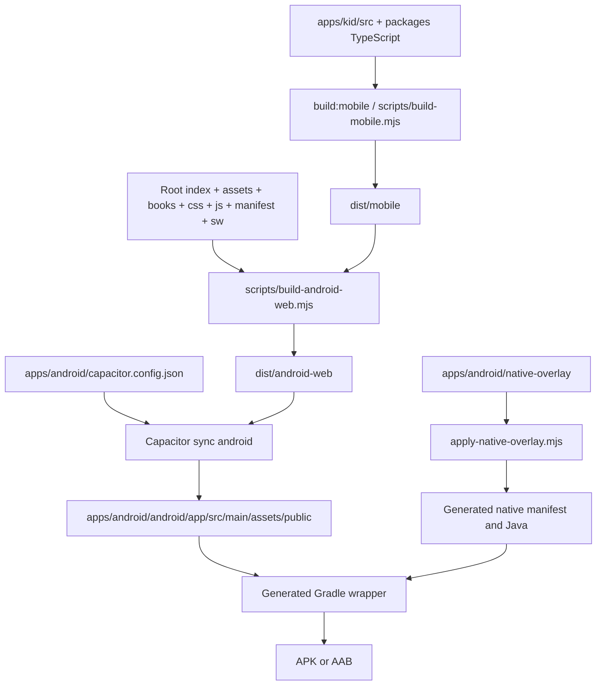
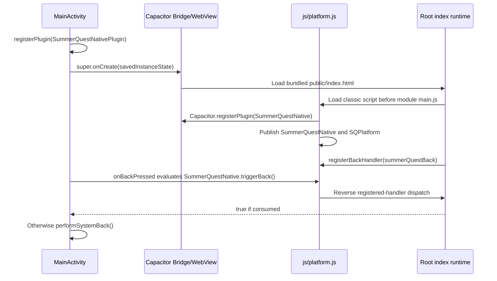

# Android packaging and tooling evidence

Audit date: 2026-10-02. Scope: the overlaid working tree, without rebuilding or changing runtime/native sources. This supplements [the architecture audit](SUMMER-QUEST-ARCHITECTURE-RECOVERY-AUDIT.md). The requested stop after the audit and recommendation takes precedence over implementing the later repair phases now.

## Findings that change the recovery plan

1. **The existing web payload contains the current root runtime but has incomplete content assets.** Recomputing its digest gives the user-reported hash, and checking executable files confirms the root entry, registry, world, platform bridge, Three.js and OrbitControls are present and byte-identical to their source counterparts. A reverse source-to-bundle check finds 190 missing files under `assets/books`, including 155 images referenced by seven integrated readers. A correct root entry and internally consistent digest do not prove source coverage.
2. **The native project and installed APK cannot be inspected here.** `apps/android/android/` and `apps/android/node_modules/` are absent in this workspace. The user-reported native payload remains external evidence; no audit result proves which APK or URL the physical tablet currently runs.
3. **Fresh builds still have concrete defects.** TypeScript is absent from root dependencies and the root lockfile; `build-mobile.mjs` directly spawns `tsc.cmd`; `build.mjs` passes strings to a helper expecting an options object. Native batch paths with spaces also need explicit quoting.
4. **Twenty-nine existing tests pass despite those defects.** They primarily inspect strings, bundle files, or mocked bridges. None runs the synchronized native payload through the requested full content/navigation loop.
5. **Some reported repairs are already present.** Capacitor config is JSON; the doctor rejects JDK 25; SDK discovery and creation of missing `local.properties` exist. Preserve these useful changes and close their remaining gaps.

## 1. Source and generated chain



| Boundary | Evidence and behavior | Audit result |
|---|---|---|
| Root npm workflow | `package.json`: `build:android-web` first calls `npm run build:mobile`, then the packaging script | Does rebuild TypeScript when invoked through npm; invoking the packaging file directly bypasses compilation |
| TypeScript output | `scripts/build-mobile.mjs:7-14`, `tsconfig.mobile.json` | Deletes `dist/mobile` before attempting compilation; includes both reusable packages and the obsolete kid-shell entry |
| Web output | `scripts/build-android-web.mjs:9-22` | Deletes `dist/android-web` before copying; does not overlay into an existing output tree |
| Source copies | Same script, directories `assets`, `books`, `css`, `js`, plus all of `dist/mobile` | Copies entire source directories, including any obsolete executable files still present there |
| Root selection | Same script, line 22 | Copies root `index.html`; does not copy `apps/kid/index.html` or create `legacy.html` |
| Config | Same script, lines 24-30 | Copies ignored local `js/config.js` when present; otherwise writes local/offline stub. Therefore future rebuilds can differ from the preserved local-only payload |
| Metadata | Same script, lines 44-62 | Hashes sorted relative paths and file bytes, with NUL delimiters; excludes the metadata itself; writes hardcoded release/runtime labels |
| Capacitor web root | `apps/android/capacitor.config.json` | `webDir: ../../dist/android-web`, HTTPS scheme, no remote `server.url`; no TypeScript config coupling |
| Bootstrap | `apps/android/scripts/bootstrap.mjs:18-23` | Builds web, adds native platform only if project directory is absent, discovers SDK, syncs, then reapplies three native overlay files |
| Sync | `apps/android/scripts/sync.mjs:17-21` | Rebuilds web, creates missing SDK properties, syncs, reapplies overlay |
| Native overlay | `apps/android/scripts/apply-native-overlay.mjs:15-29` | Overwrites manifest, MainActivity and native plugin; it does not remove other native files left by earlier generations |
| APK/AAB | `apps/android/scripts/build.mjs:27-35` | Sync by default, then wrapper task; current helper/caller mismatch loses the requested working directory |
| Build record | Same script, lines 37 onward | Selects newest matching artifact and hashes it; records release and task but not source commit, payload hash or verified runtime startup |

The web output has deliberate stale-file deletion. The native copy behavior cannot be confirmed against an installed Capacitor CLI here because dependencies/native output are absent. No project-owned post-sync check compares `assets/public` with `dist/android-web`, verifies unexpected files, or boots the synchronized payload. Bootstrap also skips native generation whenever the directory exists, even if it contains an obsolete Gradle/AGP configuration. Reapplying the three-file overlay does not repair that configuration.

### Source authority and regeneration

Keep root `index.html`, `js/`, `css/`, assets/content, TypeScript `packages/`, config, native overlay and build scripts as source. Treat these directories as generated, after preserving any evidence and checking for local modifications:

- `dist/mobile/`: emitted TypeScript modules; presently includes the kid-shell entry as well as runtime packages.
- `dist/android-web/`: web package produced by the root build.
- `apps/android/android/`: Capacitor native project, web copies and build output; currently absent and gitignored.
- `apps/android/.reports/`: local artifact/device records; gitignored.

`dist/` is not covered by the current `.gitignore`. Decide explicitly whether checked-in web output remains a release artifact. Do not silently mix editable source and copied release files, and do not delete generated evidence before taking its identity. No files were deleted for this audit.

## 2. Preserved payload identity

Read-only recomputation against `dist/android-web`:

```json
{
  "filesExcludingMetadata": 279,
  "treeSha256": "d83f338262501c1b69c1c53ae8d89f290f2e7e0b66aaf54e8bee726647f573c6",
  "metadataMatches": true
}
```

This equals the native payload metadata quoted by the user. Matching a metadata string alone would be insufficient; the following actual files were checked as well:

| Relative file | Exists in source and existing bundle | Bytes equal |
|---|---|---|
| `index.html` | Yes | Yes |
| `js/main.js` | Yes | Yes |
| `js/platform.js` | Yes | Yes |
| `js/content-registry.js` | Yes | Yes |
| `js/world/world-explorer.js` | Yes | Yes |
| `css/world-explorer.css` | Yes | Yes |
| `js/vendor/three.module.min.js` | Yes | Yes |
| `js/vendor/three.core.min.js` | Yes | Yes |
| `js/vendor/OrbitControls.js` | Yes | Yes |
| `dist/mobile/apps/kid/src/main.js` | Yes | Yes, although not selected by this root entry |

Comparison of **all 279 files already in the payload** against the corresponding root paths found only `js/config.js` different. That is the bundle's expected local-only stub. No configuration values were printed. Every other present payload file matches its current root counterpart. `legacy.html` is absent from this web package. This direction of comparison cannot detect source files omitted from the payload.

### Source coverage: correct digest, incomplete payload

The reverse comparison walked the source directories the current builder copies and checked that each file exists in the preserved bundle:

| Source directory | Source files | Absent from existing bundle |
|---|---|---|
| `assets/` | 260 | **190** |
| `books/` | 8 | 0 |
| `css/` | 9 | 0 |
| `js/` | 95 | 0 |
| `dist/mobile/` | 94 | 0 |

All 190 missing files are under `assets/books`: Animals 42, Construction 15, Giraffe 11, Minecraft 75, Public Vehicles 14, Race Cars 14, Science 19. This includes supporting files as well as images. The [content inventory](SUMMER-QUEST-CONTENT-INVENTORY.md) separately evaluates the book-data references: 178 distinct image references exist in source, Space's 23 are present under bundled `assets/solar`, and the other seven readers' **155 referenced images are absent**. Those figures describe different sets and are consistent. The main browser probe confirms an Animals image request returns 404.

The digest accurately describes this incomplete 279-file payload; it has no expected-source manifest against which to detect omissions. The current builder recursively copies all `assets/`, so the preserved tree is stale/incomplete relative to source rather than evidence of an intentional whitelist in today's script. Do not erase it before recording this mismatch. Future packaging gates must check both directions and actual content references, not merely recompute a self-described hash.

This proves the identity of the local preserved web payload. It does not establish the identity of the installed APK, a WebView document, service-worker cache contents, profile state, or physical rendering.

## 3. Native startup and Back contract



Source evidence:

- `apps/android/native-overlay/app/src/main/java/com/summerquest/app/MainActivity.java:12-13` registers the plugin before bridge creation. Lines 18-34 dispatch Back into JavaScript and fall back to native Back if not consumed or on exception.
- `js/platform.js:60-86` wraps the Capacitor plugin; lines 22-23 own the registered-handler list. Root registers `summerQuestBack` at `index.html:4878`.
- `index.html:1106` loads `platform.js` before `content-registry.js:1110` and module `main.js:1133`.
- `index.html:4767-4768` skips service-worker registration when `SummerQuestNative.native` is true. If bridge recognition fails, this check alone does not prevent registration.
- Native plugin methods cover haptics, speech and audio focus; lifecycle/audio-focus events are forwarded into web events. Java contains no child selection, content routing, grading or reward authority.
- Manifest requests internet and vibration, retains `singleTask`, and handles orientation/size/density changes.

**Executable compatibility residue:** `js/platform.js:90-109` still defines `parentAndroidAdapter()`, which delegates capabilities to a parent window. Line 114 tries it **before** the Capacitor adapter. This is inactive in a top-level root document, but remains usable when the app is embedded. `apps/android/README.md` claims there is no iframe/parent Back proxy; the source still preserves parent bridge compatibility. Remove that branch only with the planned shell removal and navigation regression, not by changing working bridge behavior during this audit.

## 4. Windows process invocation audit

Node documents that Windows `.cmd`/`.bat` files need a command interpreter and that paths with spaces must be quoted. Prefer invoking a Node program's JavaScript entry through `process.execPath`; reserve explicit controlled `cmd.exe` execution for a real batch file such as Gradle. [Node child-process documentation](https://nodejs.org/download/release/latest-jod/docs/api/child_process.html#spawning-bat-and-cmd-files-on-windows).

| Call site | Existing behavior | Required repair after review |
|---|---|---|
| `scripts/build-mobile.mjs:10-14` | `tsc.cmd` with `shell:false` on Windows; removes prior output first | Resolve root-owned TypeScript implementation and run with `process.execPath`; check dependency before deleting output |
| Conditional test builders listed below | Spawn `tsc.cmd` with default `shell:false` if selected generated entry is missing | Use the same build path, or require an explicit build; do not duplicate the incompatible spawn |
| `apps/android/scripts/lib/android-tools.mjs:10-19` | Selects `shell:true` based only on `.cmd`/`.bat` extension; caller arguments accepted without restriction | Invoke Node entry points for npm/Capacitor where practical; explicitly quote/validate controlled Gradle batch invocation; test a repository path containing spaces |
| `bootstrap.mjs:18-23`, `sync.mjs:17-21` | Use shared helper and proper `{cwd: ...}` objects | Retain flow, adopt safe invocation |
| `build.mjs:27,35` | Passes `shellRoot` and `androidProject` strings as third argument | Pass `{cwd: shellRoot}` and `{cwd: androidProject}`; current `options.cwd` reads `undefined` |
| `scripts/check.mjs` | Uses `process.execPath` for Node and `git` directly | No direct `.cmd` TypeScript invocation; test subprocesses can still be constrained by sandbox |
| `scripts/shoot.mjs` | Spawns browser executable | Different path; no `.cmd` fix needed |
| Python UI helpers | Spawn Node directly | Different path; no `.cmd` fix needed |
| Root `*.cmd` shortcuts | Use `cd /d "%~dp0"` and `call npm ...` inside the command interpreter | Correct wrapper pattern; inherit failures of invoked npm workflows |

The wrong working directory is an actual API mismatch, independent of Windows: `run()` reads `options.cwd`, but the two `build.mjs` calls supply strings. An absolute wrapper path does not select the Gradle project directory. On Windows the unquoted absolute wrapper path also contains spaces in this workspace. Do not assume fixing only `shell:false` repairs this workflow.

All direct `tsc.cmd` fallback callers found in `scripts/`:

```text
agent-routing.test.mjs              ai-eval.test.mjs
curriculum-skill-map.test.mjs        geography-knowledge-runtime.test.mjs
geography-smart-practice.test.mjs    history-knowledge-runtime.test.mjs
history-smart-practice.test.mjs      knowledge-lesson-runtime.test.mjs
language-skill-map.test.mjs          language-teach.test.mjs
learning-director.test.mjs           learning-runtime.test.mjs
learning-telemetry.test.mjs          mastery-review-scheduler.test.mjs
math-teach.test.mjs                  placement-calibration.test.mjs
science-smart-practice.test.mjs      tutor-experiment.test.mjs
tutor-policy-eval.test.mjs           vocabulary-learning.test.mjs
build-mobile.mjs
```

The fallback tests only build when an expected generated file is absent. Existing `dist/mobile` can therefore mask a broken clean build and stale TypeScript output.

## 5. Dependencies, Java and SDK

### Package ownership

- Root `package.json` and `package-lock.json` contain only `three` as a development dependency. The lockfile resolves `three@0.185.1`; TypeScript is absent from both, although mobile and agent scripts require `tsc`.
- Root `node_modules/typescript` and `node_modules/three` are absent in the audited workspace. An ambient compiler is not a reproducible package dependency.
- `apps/android/package.json` pins `@capacitor/core`, `@capacitor/android` and `@capacitor/cli` to `8.5.2`. It has no lockfile. Direct pins do not freeze transitive dependencies; `npm ci` cannot reproduce this package from a committed lockfile yet.
- Only `apps/android/capacitor.config.json` was found. No TS Capacitor config needs an Android-local TypeScript dependency. Put the compiler at the root where compilation is owned.
- Root npm test commands still use `--experimental-default-type=module`. The installed Node is `26.2.0`; that flag is rejected there. Select/document a supported Node version or replace this obsolete invocation consistently. Do not alter root package module semantics without checking CommonJS callers.

### JDK range: partially repaired, incompletely verified

`doctor.mjs:39` already enforces Java major **21 through 24**, replacing the unsafe open-ended `21+` policy. JDK 21 is the user's successful baseline. Gradle's compatibility matrix places Java 24 support at Gradle 8.14 and Java 25 support at Gradle 9.1.0; the upper bound therefore correctly rejects JDK 25 for a Gradle 8.14.3 build. The lower bound is the project's chosen Capacitor/build baseline, not Gradle's standalone minimum. [Gradle compatibility matrix](https://docs.gradle.org/current/userguide/compatibility.html).

Capacitor's official 8.0 upgrade guide specifies AGP 8.13.0, Gradle 8.14.3 and SDK 36. This supports the intended stack in the repository documentation; it does not prove the versions of a pre-existing native project, which is absent here. [Capacitor 8 Android upgrade requirements](https://capacitorjs.com/docs/updating/8-0).

Remaining checks:

1. Read the actual generated wrapper and AGP version during doctor/build rather than assuming them from a hardcoded label.
2. Confirm the Java executable used by the Gradle invocation. `resolveJava()` searches `JAVA_HOME` and PATH, but an invalid `JAVA_HOME` can be bypassed by the doctor while the batch wrapper still honors it; project/Gradle settings can also select another daemon JVM.
3. Keep JDK 21 as the verified project setup until physical build evidence covers another allowed version. Do not upgrade Gradle/AGP solely to make JDK 25 pass.

### SDK discovery: already implemented

`android-tools.mjs:67-87` searches `ANDROID_SDK_ROOT`, `ANDROID_HOME`, existing project `local.properties`, then conventional OS paths. Bootstrap and sync call `ensureLocalProperties()`; when the file is missing, it writes `sdk.dir` with forward slashes. This solves the reported missing-file case when discovery succeeds.

Gaps: an existing empty or stale `local.properties` is returned unchanged; the first existing environment directory can win over a valid project-specific SDK; discovery accepts a directory before checking the required platform; sync/bootstrap do not fail with an explicit SDK instruction when none is found. Preserve unrelated properties when correcting `sdk.dir`, and report the chosen SDK/precedence clearly.

### Local doctor result

Ran `node apps/android/scripts/doctor.mjs --strict --json` without installation or regeneration:

| Check | Observed result |
|---|---|
| Node | PASS, 26.2.0 |
| Existing web metadata | PASS, v0.6.1 / 279 files |
| Capacitor dependencies | FAIL, absent |
| Native project and wrapper | FAIL, absent |
| Java version | FAIL, executable path discovered under a JDK 21 directory, version reported unknown |
| SDK/platform 36/ADB file | PASS, files found at standard Windows SDK location |
| Authorized device | No device reported; optional unless requested |
| Overall | FAIL |

The audit environment also rejects Node subprocess spawning with `EPERM`. Treat Java's unknown version and the empty device list as limits of this run; neither proves a broken JDK or that no device could be attached outside the sandbox. Doctor currently converts command errors into these less specific results, so preserving the actual subprocess error would improve diagnosis.

Follow-up outside the sandbox: direct `adb devices -l` successfully ran and detected **one device in `unauthorized` state**. Its hardware identifier is intentionally omitted from this report. USB-debugging authorization on the device is required before shell/WebView inspection; no installed APK, active URL, or physical rendering claim was established.

## 6. Tests and their evidence limits

Ran the existing four suites without rebuilding:

```powershell
node --test --test-isolation=none scripts/android-device-foundation.test.mjs scripts/android-build-acceptance.test.mjs scripts/unified-runtime.test.mjs scripts/world-explorer.test.mjs
```

**29 passed, 0 failed.** Default Node test isolation was initially blocked by `spawn EPERM`; rerunning in one process avoids that sandbox restriction. The successful run emitted a typeless-package module warning, not an assertion failure.

| Existing check | What it establishes | Missing evidence |
|---|---|---|
| `android-device-foundation.test.mjs` | Bundle hash, root markers, absent iframe markup, mock plugin behavior, Java source patterns | Real module execution, native asset copy, installed bridge, gameplay |
| `android-build-acceptance.test.mjs` | Script strings, doctor gate names, bounded ADB parsing/selection and manifest patterns | Actual working directories, Windows quoting, clean TypeScript install/build, Gradle compatibility |
| `unified-runtime.test.mjs` | Entry/manifest markers, synthetic registry, Back function text, book link text | Real startup screen, complete catalogs, full navigation loop |
| `world-explorer.test.mjs` | World source patterns and selected file existence | WebGL initialization, local import closure, camera gestures, device rendering |
| `check-unified-runtime-ui.py` | Browser loop over part of content, served from `dist/android-web` | Expects hub immediately after Hero although current root chooses world; omits a second distinct book and Learning; not synchronized native assets |
| `check-world-explorer-ui.py` | Actual browser canvas, section/book returns and desktop drag using SwiftShader | Uses `dist/android-web`; direct API launches bypass landmark hit testing; no native WebView, touch pinch or complete content loop |
| `device.mjs smoke` | Process exists after launch/resume; saves filtered logcat | Never asserts DOM, world health, selected child, content return or absence of JavaScript errors |

The world browser check would time out if no canvas appears; the static world suite can pass while the world never runs. The unified browser check's immediate hub expectation is stale. Both Python scripts default to Linux browser/output paths, though these can be overridden. Neither is part of the four passing Node suites.

### Required release gate after the architecture review

Use the existing browser test style and one shared scenario instead of another routing abstraction:

1. Compile from clean locked dependencies in a Windows checkout whose path has spaces. Verify both mobile and agent builds, with a root-owned compiler.
2. Sync, compare executable file bytes and local module import targets in `assets/public` to the intended web package, and reject root-shell/legacy iframe entries. Verify native overlay identity separately.
3. Serve **the synchronized `assets/public` tree** to the browser harness. Assert cold start, Hero choice, expected screen, one visible global shell, selected child and no page errors. Merely finding a canvas or `android-build.json` is insufficient.
4. Run Hero → child → world/hub → Games → game → Back → Books → book → Back → Books → different book → Back → Music → instrument → Back → Learning → activity → Back. Repeat; assert original surface/child, single headers and no root document inside any iframe after each return.
5. Run with empty and restored local state, offline requests, an explicit WebGL failure, and expected module loading. A world failure must be visible and must not count as successful 3D startup.
6. Record APK hash, embedded web digest, release/entry/current URL, runtime surface, child, navigation state, world/WebGL status, registry count and native bridge status on the actual tablet. Keep the existing manual hardware checklist for audio, Back, process death, gestures and offline launch.

These checks belong in the implementation plan. This audit does not claim a successful clean build, synchronized native-package test, APK installation or physical-device acceptance.
