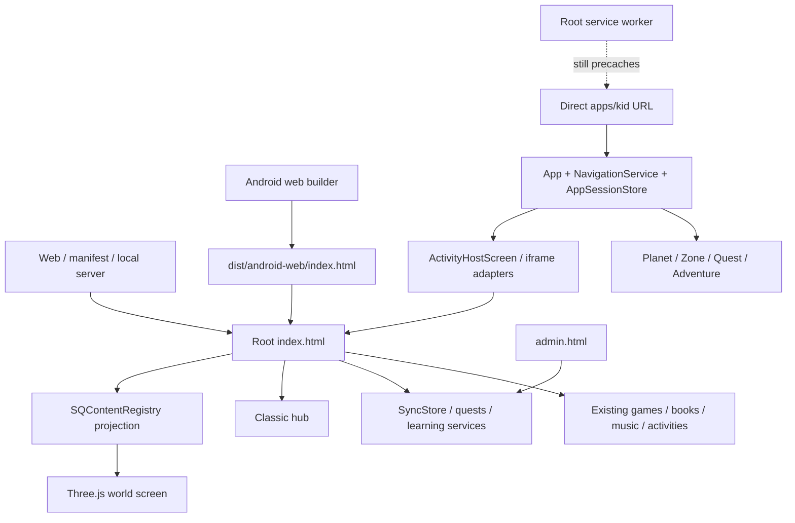

# Summer Quest architecture recovery audit

Date: 2026-10-02. Status: **repository audit complete; device diagnosis pending; integration proposed, not implemented**.

## Conclusion

Summer Quest's product is the root application and its accumulated content, state, and learning services. Keep that application authoritative. Selectively integrate the Android container, registry adapter, and 3D screen into it; retire the executable child-shell experiment from product distribution.

The reported flat selector is **exactly the newer `apps/kid` Planet screen**, including its four places, `LEGACY` badge, and landscape right navigation. It is not the original Classic hub and is not the root world's error fallback. A fresh desktop browser reproduces that screen at `/apps/kid/index.html`; `/index.html` and `/dist/android-web/index.html` instead show child selection followed by a genuine WebGL world.

**The installed tablet's entry path remains unverified.** The local generated web bundle matches the supplied v0.6.1 fingerprint, but this workspace has no `apps/android/android/`, installed APK capture, authorized WebView inspection, WebView URL, or tablet console trace. A final ADB check outside the sandbox detects one Android device with status **unauthorized**; USB-debugging authorization on the device is required to inspect it. Consequently this report establishes the exact screen-producing code path, but does not claim that an old APK, service worker, WebGL failure, or stored preference caused the physical device to enter it. That last causal link is a blocking device-evidence item.

## Scope and evidence

The requested input is `SUMMER-QUEST-ARCHITECTURE-RECOVERY-AND-INTEGRATION-AUDIT.md`. Its stop point says: “stop for review unless a change is obviously small, reversible, and required to complete the audit.” This delivery adds reports and a read-only browser probe. It does not refactor runtime code, rebuild over the existing payload, remove prototypes, or change family state.

The audited checkout is an uncommitted merged tree over Git `af77f74` (`muted TTS`). Many modern files are untracked; many original files are modified. The new audit branch/commit records this investigation, **not a committed snapshot of that overlay**. Source line references describe the working tree audited on this date. Do not treat the branch alone as a reproducible v0.6.1 application release.

Evidence appendices form part of this report:

- [Runtime, entry points, navigation, and world evidence](SUMMER-QUEST-RUNTIME-EVIDENCE.md).
- [Complete content inventory and registry coverage](SUMMER-QUEST-CONTENT-INVENTORY.md).
- [Android packaging, tooling, and test evidence](SUMMER-QUEST-ANDROID-TOOLING-EVIDENCE.md).
- [Recorded browser observations](runtime-probe.json) and [re-runnable audit probe](../../scripts/audit-architecture-runtime.py).
- [Recommendation and phased implementation checklist](../plans/SUMMER-QUEST-ARCHITECTURE-RECOVERY-PLAN.md).

Evidence levels used here: source trace; locally executed browser/Node checks; supplied historical release claims; physical-device verification pending. These are distinct.

## 1. Original, newer, and actual merged architecture

### Original product

`index.html` owns child choice, progress, launchers, and screen transitions. It uses `js/sync.js`, game modules/manifest, Brain Gym, books, music, activities, and Learn guides. `admin.html` is a separate parent/operator application. Standalone books navigate to `../index.html#books`. Individual game modules and their lifecycle are content, not additional application shells. The current `startLegacy()` displays a “Still loading” placeholder when a game module is unavailable; it is neither a working old-game implementation nor an iframe shell.

### Later additions

The September overlay adds typed learning/director/knowledge services, quests, Android integration, and a separate child-shell experiment with `NavigationService`, `AppSessionStore`, Planet/Zone screens, and iframe legacy activity adapters. The v0.6 root work then adds `SQContentRegistry`, `SQAppNavigation`, native Back registration, and the Three.js world inside `index.html`.

### Current merged tree



The root is the configured product entry, but the old experiment remains executable through its URL, service-worker resources, generated modules, and public static deployment. A README calling it non-authoritative does not retire its routing behavior.

## 2. Entry points and exact tablet screen (A–B)

The runtime appendix inventories source/generated/root/PWA/Android/standalone/admin/demo entry points with reachability and disposition. Key paths:

| Entry | Authority and current reachability |
| --- | --- |
| `/index.html` | Intended product authority; serves both Classic and world |
| Manifest `./index.html` | Current PWA identity/start URL; existing installations/cache require separate observation |
| `/apps/kid/index.html` | Reachable prototype; reproduces the observed selector |
| `/dist/android-web/index.html` | Existing generated v0.6.1 root payload; locally browser-tested |
| Native `assets/public/index.html` | Expected Capacitor entry; absent from this checkout, not tested |
| Standalone `/books/*.html` | Real historical readers; return links target root `#books` |
| `admin.html` | Legitimate parent interface; must survive separately |
| Admin prototypes / `#devcube` | Development artifacts; exclude from child distribution |

Exact selector chain:

```text
apps/kid/index.html
  -> dist/mobile/apps/kid/src/main.js (source: apps/kid/src/main.ts)
  -> createPlatformService() sees SQPlatform, no SummerQuestNative.native
  -> LegacyPlatformService.kind = "legacy"
  -> NavigationService({name: "planet"})
  -> App.render() -> renderPlanetScreen()
     -> WorldModel four zones
     -> platform.kind.toUpperCase() => LEGACY
     -> World / Quests / Adventure navigation
```

Source anchors: `apps/kid/src/screens/PlanetScreen.ts:25`, `packages/world/src/WorldModel.ts:32`, `apps/kid/src/main.ts:83`, `apps/kid/src/app/App.ts:40`, `packages/platform/src/createPlatformService.ts:14`, `apps/kid/styles.css:66`.

`LEGACY` is deliberately interpolated developer/platform information that leaked into child-facing chrome. It reports adapter selection, not application age, APK release, or WebGL capability.

Why it wins **when that entry is opened**: the shell bootstraps the Planet route and never calls root `openWorld()`. Root storage restoration cannot select `apps/kid`; root WebGL exceptions only reveal `#worldStatus`. No discovered exception/fallback path transforms the root page into the selector. The shell does write shared `sq:view=hub`, which can affect a later root visit, but that selects the Classic hub, not PlanetScreen.

## 3. Startup and navigation authority (C–D)

```text
Native MainActivity / Capacitor bridge (source present; native output absent)
  -> configured webDir ../../dist/android-web
  -> root HTML classic scripts, data, platform and learning bridges
     + deferred js/main.js separately publishes SQManifest / SQGames / SQLoadGame
  -> inline bindings for registry and native Back (before deferred publication)
  -> loadProgress() -> restoreAppPlace()
     -> no valid child: home / Hero choice
     -> valid stored view: home / hub / world / activity / book / music
  -> selectKid() / PIN success -> openWorld()
     -> showOnly("world") -> local dynamic import world-explorer.js
     -> vendored Three.js + OrbitControls -> renderer
     -> error: visible worldStatus and console error; Classic button remains
```

`index.html:4723` restores `sq:kid`, `sq:view`, `sq:hubTab`, and activity/book/music selection; `:4957` starts initialization. There is no general v0.6 release migration that forces stored Classic sessions to the world. `:1577` manages asynchronous world tokens and child identity; `:1602` handles child selection. `js/main.js` publishes manifest readiness separately, so the registry must not be considered complete before it loads.

Current navigation participants:

- Root launchers and `showOnly()` own surfaces, child state, teardown, and `sq:*` place keys.
- `summerQuestBack()` handles content/overlays/world/hub; `SQAppNavigation` only exposes Back and surface inspection.
- `SQActivityRouter` supplies activity state/adapters and agent context; it is not a complete replacement for root navigation.
- `SQContentRegistry.open()` dispatches into root launchers. Classic buttons still invoke those launchers directly.
- `NavigationService` plus shell activity adapters form a genuinely separate router/session/iframe stack.
- `js/platform.js` bridges native Back but retains a parent-window Android adapter.
- Standalone book navigation and root Escape handling have independent return behavior.
- Admin navigation is a separate operator context and should not be folded into the child router.

### Confirmed screen-transition bug

`startGame()` at `index.html:1735` hides only `home`, `hub`, and `act` (`:1755`) and reveals `game`. It bypasses `showOnly("game")`, so world cleanup/pause and hiding do not happen. The new browser probe observes **both `world` and `game` active**, while `SQAppNavigation.getSurface()` reports only `game`. This occurs on source and generated payload. Shared Back returns to the world. Fix this in the shared launcher after review, preserving lock checks and lifecycle ordering; do not patch individual world landmarks.

## 4. Original content and registry (E–F)

The inventory appendix lists every item and its source, launcher, assets, return path, and verification limit. Totals from real source catalogs:

| Content | Audited inventory |
| --- | --- |
| Games | 21 manifest games, including 9 Brain Gym games |
| Music | 3 instruments: piano, synth, pads |
| Books | 8 shelves/data sets and 8 standalone reader documents |
| Activities | 11 BANK entries with positional IDs |
| Learn guides | 3 guide modes |
| Knowledge lessons | 18 typed lessons across Science, Geography, History |
| Curriculum | 45 skill IDs |
| Daily product | 16 day blocks, 12 default quests, 4 rewards |

The later typed learning services are real product code to preserve. They are not part of historical `af77f74`; restoring that revision wholesale would discard them.

`js/content-registry.js` is already a bound projection, not an independent hand-maintained catalog. `index.html:4812` builds 51 entries once the manifest is ready: 8 sections, 21 games, 3 music, 8 books, 11 activities. Before manifest publication it can expose 46 entries. Preserve this adapter design and complete it rather than creating a second catalog.

Current gaps:

- Individual Learn guides, knowledge lessons, quests/rewards, and learning session modes are not individually discoverable through it.
- `activity:0` etc. are aliases for BANK indices; reordering that array would change their meaning. Existing game/book IDs are preserved under kind prefixes.
- Availability is coarser than launch policy: it marks all games unavailable under a Games lock, whereas Brain Gym and Paint intentionally remain accessible.
- Launch dispatch often returns `{ok:true}` before a lock rejection or asynchronous game failure is known.
- Classic bypasses the public registry/navigation surface. The world contains 8 section destinations and 4 hard-coded featured items; it does not enumerate all normalized content.

## 5. World and Android (G–I)

The world is genuine Three.js 0.185.1, using locally vendored module/core/OrbitControls files, a WebGL renderer, raycasting, touch controls, and bounded zoom. Root owns return destinations; the world holds its camera/scene and saves per-child camera state in an in-memory Map. Reloading loses that camera state. Source details and lifecycle shortcomings are in the runtime appendix. Desktop software-WebGL startup passed; Android GPU, touch, resize/resume, and context-loss behavior remain unverified.

The packaging appendix traces `build:mobile -> build:android-web -> dist/android-web -> cap sync -> native assets/public -> Gradle`. Observed facts:

- Existing payload has 279 files and recomputed SHA-256 `d83f338262501c1b69c1c53ae8d89f290f2e7e0b66aaf54e8bee726647f573c6`, matching the supplied metadata.
- Root HTML and its executable world/registry/platform/vendor modules match source. `legacy.html` and `apps/kid/index.html` are not packaged, but unused compiled child-shell modules are included through the blanket `dist/mobile` copy.
- Reverse source-to-payload comparison finds **190 missing files under `assets/books`**, including **155 distinct image paths referenced by the seven non-Space books**. Source contains all 178 referenced book images; the bundle contains only Space's 23. Matching every file already present in the bundle cannot detect these omissions. The current copy script includes the full assets directory, so the preserved bundle is incomplete relative to today's source.
- The builder removes its output first, so it is not an incremental overlay builder. No rebuild was performed during this audit, preserving the supplied artifact for comparison.
- Native project, native payload, Gradle wrapper and installed Android dependencies are missing here. The native payload cannot be certified by testing `dist/android-web`.
- Root package/lock lacks TypeScript. `build-mobile.mjs` invokes `tsc.cmd` with `shell:false` and deletes output before compiler availability is established.
- Android helper uses blanket `shell:true` for batch files; Gradle call sites pass a directory string where the helper expects an options object. Quoting a batch path with spaces also needs attention.
- Capacitor configuration is already JSON; JDK checking already uses a 21–24 major-version range; SDK discovery and local.properties creation already exist. Verify and repair these paths rather than blindly reapplying old fixes.
- This workstation's Node 26 rejects `--experimental-default-type=module`, still present in package commands. The four-suite run succeeds with `node --test --test-isolation=none`; default isolated execution was blocked by sandbox process permissions in that audit run.
- GitHub Pages currently uploads the repository root without building generated dependencies or restricting prototypes. A clean checkout cannot inherit untracked build output.

## 6. Verification performed and false confidence

| Check | Result and limit |
| --- | --- |
| Existing Android foundation, acceptance, unified, world tests | 29/29 pass; mainly source/metadata/VM assertions, not device startup |
| Source and generated payload browser startup | Hero choice -> world canvas; one app shell, 51 registry entries after readiness |
| World -> Space -> Back -> Animals -> Back | Navigation passes on both; generated Animals reader requests missing elephant image |
| World -> Calculations | Fails single-visible-screen invariant on both: world + game |
| Calculations -> shared Back | Returns to world |
| World -> Piano -> shared Back | Passes on both |
| Explicit `/apps/kid/index.html` | Reproduces flat selector and LEGACY in one prototype shell |
| Forced WebGL context-creation failure on source and generated root | Visible world error, stays on world, no PlanetScreen or shell fallback |
| Native public payload / physical tablet | Native directory absent; ADB detects one unauthorized device, so physical inspection is blocked and not passed |
| Every game, instrument, book page, learning activity | Inventory completed; exhaustive interaction suite remains proposed |

Browser: Edge 154.0.4258.48, fresh contexts, 1024×768, software WebGL, remote requests/config disabled, service workers blocked. Blocking external font requests is intentional. Two additional contexts intercept WebGL context creation to exercise the root's initialization error handler; their expected console errors are captured. These observations do not test cache migration or the actual tablet. `runtime-probe.json` records the failures and the probe exits nonzero; this is evidence of defects, not a passing release gate. Python syntax and all local links in the five reports were also checked successfully.

Re-run without changing source or generated output:

```powershell
node --test --test-isolation=none scripts/android-device-foundation.test.mjs scripts/android-build-acceptance.test.mjs scripts/unified-runtime.test.mjs scripts/world-explorer.test.mjs
python scripts/audit-architecture-runtime.py --browser 'C:/Program Files (x86)/Microsoft/Edge/Application/msedge.exe' --out docs/audits/runtime-probe.json
```

Existing `check-unified-runtime-ui.py` expects the hub immediately after child selection and is stale. `check-world-explorer-ui.py` checks canvas presence and a small launch sample; its drag check does not assert camera movement. Neither checks native `assets/public`. The release's prior browser run was explicitly blocked and physical validation pending; static PASS results must not replace those missing gates.

## 7. Priority risks and decision

| Priority | Risk | Required response |
| --- | --- | --- |
| Blocking diagnosis | Actual installed entry/cache/bridge unknown | Capture device URL, package, loaded module paths, console, bridge flags before replacing/clearing data |
| High | Two executable child runtimes | Remove prototype from product entry/build/SW/deployment; preserve actual content |
| High | Root launcher bypasses world transition lifecycle | Consolidate launcher transitions in existing root authority; retain failing browser assertion |
| High | Fresh checkout cannot reproduce overlaid build | Declare compiler ownership, lock inputs, fix process invocation/cwd; verify clean install |
| High | Typed learning/state lost by wholesale rollback | Preserve later learning services and existing storage keys/ledger |
| Medium | Registry coverage and lock policy diverge | Derive registry/policy from authoritative catalogs/launch checks |
| High | 155 referenced book images absent from otherwise hash-valid payload | Compare source and payload in both directions, and validate JS book-data references separately from standalone HTML assets |
| Medium | Native and cache tests absent | Test synchronized native payload and physical offline/relaunch path |

Recommendation: **Strategy C, selective merge with the existing root runtime authoritative.** The [plan](../plans/SUMMER-QUEST-ARCHITECTURE-RECOVERY-PLAN.md) compares alternatives, identifies keep/adapt/retire paths, defines one public API, and supplies phased acceptance checks. Review that decision before implementation. World visual polish remains deferred.
