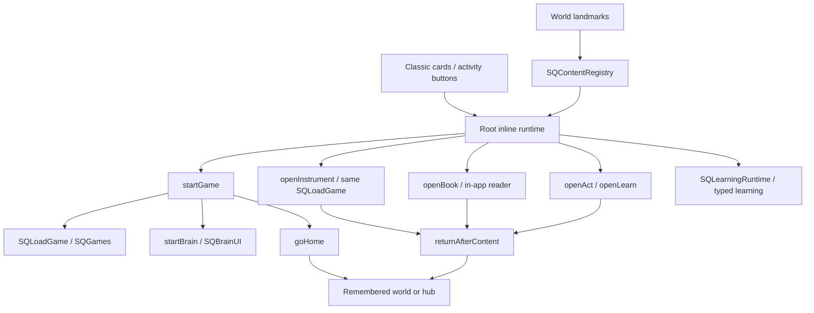

# Summer Quest content inventory and registry audit

Date: 2026-10-02. Scope: the current overlaid working tree, with tracked `HEAD` (`af77f74`, `muted TTS`) used to distinguish earlier architecture. Companion to [the architecture recovery audit](SUMMER-QUEST-ARCHITECTURE-RECOVERY-AUDIT.md).

## Evidence and status limits

This inventory comes from executable catalogs, their callers, local asset paths, and the tracked original. It does not certify tablet functionality. **Source connected** below means a catalog entry has an implementation and a reachable source call chain; touch input, sound, completion and physical-device Back remain unverified here. Browser/device checks in the main audit take precedence where they provide stronger evidence.

Counts after `js/main.js` publishes the manifest: **21 games, 3 instruments, 11 bank activities, 8 books, 3 learning guides, 18 knowledge lessons, 45 curriculum skill IDs, 12 default quests, 4 default shop rewards, and 16 daily blocks**. Quests/rewards are configurable; these are seed counts, not a claim about a family's saved catalog. Learn guides have numeric completion IDs outside the activity bank.

Read-only Node VM extraction evaluated the data files and the `BOOK_SHELF` literal, counted all book arrays, and checked all 178 distinct `../assets/…` references across those arrays. All 178 files exist in source. **The existing generated `dist/android-web` contains Space's 23 references but lacks all 155 references under `assets/books` used by the other seven books.** A browser request for Animals' `elephant.jpg` returned 404 during the main audit. The current build script recursively copies the entire source assets directory (`scripts/build-android-web.mjs:15`), so this is evidence of a stale/incomplete generated overlay, not a current assets whitelist. The native `apps/android/android/app/src/main/assets/public` directory is absent in this checkout; no synced native payload was available for this inventory.

The older tracked root already has the game host, Brain Gym, books, Music Room, activities, daily schedule and learning guides. The current typed adaptive/knowledge learning, quest framework, normalized content registry and world are later additions. Their value should be judged by behavior; restoring `HEAD` wholesale would discard later real features.

## 1. Launch and return contracts

Evidence: `index.html:1176` metadata helpers, `:1563` return capture, `:1735` game launcher, `:1879` Brain host, `:2040` game return, `:3237` activities, `:3840` guides, `:3975` instruments, `:4051` reader, `:4812` registry binding. `js/main.js:20` lazy-loads `./games/<id>.js`, registers the default export and returns it; `js/games/registry.js:8` validates registrations.

Return labels used in the inventories:

- **G:** `goHome()` stops the arena and returns to the captured world or opens the child's hub. Directed practice instead returns to Learn. Game restarts/switching reuse the same captured origin.
- **A:** the activity Back button stops its timer, then `returnAfterContent('acts')` returns to the captured world or Activities. A guide opened from Learn shares this button and therefore currently falls back to Activities, a preexisting semantic mismatch to resolve explicitly.
- **B:** `closeBook()` clears the grid and returns to the captured world or Books; Android Back first exits the book grid/zoom if present.
- **M:** `closeInstrument(false)` calls the instrument's `stop()`, clears its stage, then returns to the captured world or Music.
- **L:** embedded Learn panels remain in the hub; directed game Back returns to Learn. Knowledge lessons can pause and return to Smart Practice inside Learn.

**Shared risks:** `startGame` manually hides only `home`, `hub`, `act` (`index.html:1757`), instead of calling `showOnly('game')`; a direct world game launch leaves the world visible and its render loop running. The main audit reproduced simultaneous world/game visibility by opening `game:calc` in a browser. `SQContentRegistry.open` reports successful dispatch before asynchronous content initialization succeeds. `startLegacy` is only a “Still loading” message (`:1874`), not an old working game implementation. Failed dynamic imports can therefore appear as permanent loading.

## 2. Games: every manifest entry outside Music

Catalog authority: `js/games/index.js:6`, projected through `allGameIds()` and `gameMeta()`. `LEVELS` at `index.html:1147` still duplicates metadata for 19 entries and takes precedence over manifest metadata; remove this duplication only after the module-ready startup path is safe. Every row currently receives the registry alias `game:<id>`.

Launcher **G1** = Classic Games/switcher or registry → `startGame(child,id)` → `SQLoadGame(id)` → `runRegistered` with shared `gameCtx`. Launcher **G2** = same root launcher → `startBrain(id)` → `SQBrainUI`; Brain items intentionally have no per-game module. All rows use return **G**.

| Stable ID | Title | Implementation/source | Launcher | Assets/dependencies | Current status |
|---|---|---|---|---|---|
| `machines` | Big Machines | `js/games/machines.js` | G1 | DOM/emoji, host keyboard/audio | Source connected |
| `city` | City Drive | `js/games/city.js` | G1 | Procedural display, host services | Source connected |
| `monster-truck` | Monster Truck | `js/games/monster-truck.js` | G1 | Local Three.js; procedural 3D | Source connected; WebGL required |
| `dig` | Dig Site | `js/games/dig.js` | G1 | Procedural display, host services | Source connected |
| `balloon` | Balloon Pop | `js/games/balloon.js` | G1 | DOM/emoji, host keyboard/audio | Source connected |
| `hunt` | Key Hunt | `js/games/hunt.js` | G1 | Host word/keyboard/Bopomofo data | Source connected |
| `home` | Home Row | `js/games/home.js` | G1 | Host word/keyboard/Bopomofo data | Source connected |
| `race` | Word Racer | `js/games/race.js` | G1 | Host word/keyboard/Bopomofo data | Source connected |
| `orc` | Orc Attack | `js/games/orc.js` | G1 | `assets/orc/sprites/*.png`, host word/audio data | Source connected |
| `vocab` | Word Wizard | `js/games/vocab.js` | G1 | Host `VOCAB`; compiled `LanguageSkillRules.js`; learning bridge | Source connected; depends on generated typed module even for ordinary module import |
| `solar` | Solar System | `js/games/solar.js`, `solar-data.js`, `solar-sim.js`, `solar-quiz.js` | G1 | Three.js/OrbitControls, `assets/solar/` and `tex/` | Source connected; missing `tex/pluto.png` retains the explicit fallback material (`solar.js:723`) |
| `paint` | Paint & Colour | `js/games/paint.js`, `paint-sheets.js` | G1 | Code-defined drawing sheets | Source connected; deliberately exempt from game locks |
| `calc` | Calculations | `js/brain-data.js`, `brain-core.js`, `brain-ui.js`; typed math bridge | G2 | Procedural Brain scene, local math generators | Source connected; ordinary Brain and directed Math share implementation |
| `signs` | Sign Finder | Same Brain core/data/UI | G2 | Procedural Brain scene | Source connected |
| `lowhigh` | Low to High | Same Brain core/data/UI | G2 | Procedural Brain scene | Source connected |
| `stroop` | Color Words | Same Brain core/data/UI | G2 | Procedural Brain scene | Source connected |
| `crunch` | Number Cruncher | Same Brain core/data/UI | G2 | Procedural Brain scene | Source connected |
| `clock` | Time Lapse | Same Brain core/data/UI | G2 | Procedural clock display | Source connected |
| `change` | Change Maker | Same core plus `js/brain/scenes/change.js` | G2 | `assets/brain/sprites/change.png`, sprite manifest | Source connected |
| `wordmem` | Word Memory | Same Brain core/data/UI | G2 | Word/Bopomofo pools | Source connected |
| `recall` | Math Recall | Same core plus `js/brain/scenes/recall.js` | G2 | Procedural scene | Source connected |

`js/games/cube.js` is a deliberately excluded developer probe, loaded only by `#devcube` in `js/main.js:36`; it is not product content and should not acquire a child-facing catalog tile. Supporting files such as `solar-sim`, `keys-ui` and sheet/chart data are not standalone games.

Persisted score keys are not always content IDs: `vocab` uses `shop`, Monster Truck uses `monster_truck`, Brain uses `brain_<id>` plus duration fields. Preserve these when normalizing IDs. Stars are derived via `store.starsFor`, not accumulated by the registry.

## 3. Activities: full bank and guide inventory

Authority: `js/act-data.js:3` (`SQ_ACT_DATA`), bound as `BANK` at `index.html:1288`. `ACT_GUIDE` at `:1360`, `BANK_POOL` at `:1373`, `MISSIONS` at `:1290`, and `PHOTO_POOL` at `:1381` contain the instructions and mission data. The bank index is persisted as `act_done.act_idx`; reordering it changes user history.

All bank rows launch via Classic Activities → `openAct(index)` or `SQContentRegistry.open('activity:<index>')`, use return **A**, and have **source connected / physical completion unverified** status. Assets are inline emoji, bilingual text and mission pools; these are guided real-world activities, not separate games or external app embeds.

| Persisted index / registry alias | Title | Mission/instruction source | Assets/extra behavior |
|---|---|---|---|
| `0` / `activity:0` | Roof gym — motricity | Bank/guide index 0; `MISSIONS.gym` | Movement instructions/timer |
| `1` / `activity:1` | Boxing bag | Index 1; `MISSIONS.boxing` | Instructions/timer |
| `2` / `activity:2` | Outdoor (evening, when cool) | Index 2; `MISSIONS.outdoor` | Outdoor prompts |
| `3` / `activity:3` | Desk — creative | Index 3; `MISSIONS.desk` | Drawing/craft prompts; mentions Paint |
| `4` / `activity:4` | Weekly craft project | Index 4; `MISSIONS.craft` | Craft prompts |
| `5` / `activity:5` | Photo & video missions | Index 5; `PHOTO_POOL`, `PHOTO_TRICKS` | Photo prompts; proofs use separate upload flow |
| `6` / `activity:6` | Computer, AI & web (grown-up OK) | Index 6; `MISSIONS.computer` | Guided prompts; no separate AI provider implementation here |
| `7` / `activity:7` | Boredom → creativity | Index 7; `MISSIONS.boredom` | Invention prompts |
| `8` / `activity:8` | House help (extra stars) | Index 8; `MISSIONS.house` | Chore prompts; label does not imply this button grants stars |
| `9` / `activity:9` | Active screen (heat backup) | Index 9; `MISSIONS.activescreen` | Follow-along suggestions |
| `10` / `activity:10` | Minecraft missions | Index 10; `MISSIONS.minecraft` | Building prompts for the separate Minecraft game |

The “I did it” action records activity completion; comments at `index.html:3294` explain removal of unrestricted self-awarded stars. Do not reintroduce an award through a new registry adapter.

Guides use the same activity screen, but a distinct stable numeric completion band from `js/learn-data.js:72`:

| Existing route / completion ID | Title | Source | Launcher / return | Registry / status |
|---|---|---|---|---|
| `Lknow` / `1000` | I want to KNOW something | `LEARN_GUIDES.know`, per-child steps | `openLearn('know')` / A | Missing individual entry; source connected |
| `Ldoskill` / `1001` | I want to LEARN to do something | `LEARN_GUIDES.doskill` | `openLearn('doskill')` / A | Missing individual entry; source connected |
| `Laskai` / `1002` | How to ask AI well | `LEARN_GUIDES.askai` | `openLearn('askai')` / A | Missing individual entry; source connected |

Do not reinterpret the string `L…` routes as numeric bank indexes or renumber `LEARN_KEYS`. The separate question builder at `index.html:3787` uses `QB_STARTERS/QB_TOPICS`, logs composed searches, and provides external search links. Those searches require connectivity; local guides do not.

## 4. Books: all eight are populated

Authority: `BOOK_SHELF` at `index.html:3924`, content under `js/books/`. Launcher for every row is `renderBooks()` → `openBook(id)` → the root in-app reader; registry alias `book:<id>` dispatches the same function. Return is **B**. `canOpenBook()` checks the loaded array, not `ready`. Five stale `ready:false` values therefore do **not** mean five books are unavailable.

| ID / title | Data source / global | Content count | Assets | Status |
|---|---|---:|---|---|
| `space` / Space | `js/books/space-data.js` / `SPACE_CARDS` | 23 cards | 23 referenced photos under `assets/solar/` | Populated; all referenced assets found |
| `animals` / Animals | `js/books/animals-data.js` / `ANIMALS_CARDS` | 41 cards | `assets/books/animals/` | Populated despite `ready:false`; assets found |
| `giraffe` / Giraffe | `js/books/giraffe-data.js` / `GIRAFFE_CARDS` | 10 cards | `assets/books/giraffe/` | Populated; assets found |
| `minecraft` / Minecraft | `js/books/minecraft-data.js` / `MINECRAFT_SPREADS`; `minecraft-magazine.js` renderer | 18 topic records / 36 page-pair turns | 46 distinct references under `assets/books/minecraft/` | Populated; source assets found; four mini-pages per topic |
| `science` / Science | `js/books/science-data.js` / `SCIENCE_CARDS` | 18 cards | `assets/books/science/` | Populated despite `ready:false`; assets found |
| `race-cars` / Race Cars | `js/books/race-cars-data.js` / `RACE_CARS` | 13 cards | `assets/books/race-cars/` | Populated despite `ready:false`; assets found |
| `construction` / Construction | `js/books/construction-data.js` / `CONSTRUCTION_CARDS` | 14 cards | `assets/books/construction/` | Populated despite `ready:false`; assets found |
| `public-vehicles` / Public Vehicles | `js/books/public-vehicles-data.js` / `PUBLIC_VEHICLES_CARDS` | 13 cards | `assets/books/public-vehicles/` | Populated despite `ready:false`; assets found |

All eight also have standalone `books/<id>.html` pages. Each Shelf button assigns `../index.html#books`: `space.html:206`, `minecraft.html:165`, all other book pages at `:221`. These are still direct-navigation routes; they are not the root shelf's launcher. `BOOK_SHELF.file` is unused by the in-app open path (`minecraft.file` is null even though a standalone page exists).

“Assets found” in this table means **source assets**. Seven books currently have missing generated images as described above. A book opening and returning successfully does not verify that its images loaded.

In the unified root layout, that relative link targets the root. In the deprecated child-shell layout, it can target the shell document from inside an iframe and recreate the known recursion. Preserve bookmarks via an explicit root redirect/route contract; do not reuse these pages as app hosts. Root `bookPhoto()` removes the leading `../` from shared data so images resolve both in standalone pages and the in-app reader (`index.html:3938`).

## 5. Music Room and instruments

Authority: three `music:true` entries in `js/games/index.js`. `musicIds()` filters them out of the arcade. `renderMusic()` → `openInstrument(id)` → `SQLoadGame` → `runRegistered(game,musicStage,child)` uses the same `gameCtx` as arcade games. All return **M**; all are source connected, with physical audio/input latency unverified.

| ID / registry alias | Title | Implementation/data | Audio assets |
|---|---|---|---|
| `pads` / `music:pads` | Drum Pads | `js/games/pads.js`, `pad-charts.js`; transport/judging in `js/game-services/music.js` | `assets/audio/mpc/kit.json` and 12 WAVs: clap, cowbell, crash, hat-closed, hat-open, kick, rimshot, shaker, snare, tom-high, tom-low, zap |
| `piano` / `music:piano` | Piano | `js/games/piano.js`, `piano-drills.js`, shared `keys-ui.js` | Web Audio synthesis; shared audio/scheduler |
| `moog` / `music:moog` | Synth | `js/games/moog.js`, shared `keys-ui.js` | Web Audio synthesis; shared audio/scheduler |

Music Room also hosts the tap/calibration flow at `index.html:4009`; its calibration is stored under `sq.music.latency`. Preserve this device setting. Rotation guidance, transport, timing offsets and tone shutdown belong to the existing music host/services. `assets/audio/brain/README.md` is not a populated sample pack. There is no microphone/MIDI/network band-sync feature in this inventory.

## 6. Learning and AI

### Runtime and authority

`js/learning-runtime.js:28` lazily imports typed modules from `dist/mobile/packages/…`; their sources are under `packages/learning/src`. `LocalStorageDriver` backs learner profiles, practice evidence, placement, lesson state and director sessions. Optional `SUMMER_AGENT_ENDPOINT` enables `AgentHttpClient`; no endpoint means local generators/scaffolds remain the intended path. Remote telemetry is separately configured. `status()` returns `ready:false` if module initialization fails; static file existence alone cannot establish readiness.

| Feature | Sources and actual launcher | Return / status / registry |
|---|---|---|
| Math / Brain Gym | `startBrain('calc')`; `BrainMathLearningBridge`, `BrainMathQuestionAdapter`, `MathQuestionGenerator`, `MathScaffold`; `LearningSessionEngine` | G or L; source connected; only coarse `game:calc` entry |
| Language / Word Wizard | `startGame(child,'vocab')`; `VocabularyLearningBridge`, `LanguageSkillRules`, host VOCAB and `js/bopomofo.js` | G or L; source connected; only coarse `game:vocab` entry |
| Smart Practice / Learning Director | `renderLearningDirector()` and start/complete/pause actions; `director/LearningDirector.ts`, `LearningDirectorStore.ts`, `legacy/LearningDirectorBridge.ts` | L; no individual registry entry |
| Placement / quick check | `renderPlacementCalibration()` → `PlacementCalibrationBridge`; `placement/PlacementCalibration.ts` and Store | L; no entry; no stars or AI hints in calibration |
| Math teaching | `renderLearningTeachScene()`; `MathTeachBridge`, `teach/MathTeachScene`, Request/Service | L; local scene plus optional remote help; no entry |
| Language teaching | Same root scene dispatcher; `LanguageTeachBridge`, `teach/LanguageTeachScene`, Request/Service | L; local scene plus optional remote help; no entry |
| Science / Science Lab | `renderKnowledgeLab('science')` → science catalog/start/answer/advance methods in `SQLearningRuntime` | L; six lessons below; no per-lesson entries |
| Geography / Map Explorer | `renderKnowledgeLab('geography')` → geography equivalents | L; six lessons below; no per-lesson entries |
| History / Time Traveler | `renderKnowledgeLab('history')` → history equivalents | L; six lessons below; no per-lesson entries |
| Explore / Check | Phases inside `KnowledgeLessonRuntime`, displayed by `renderKnowledgeLab`; locally graded question answers | L; phases, not independent apps or games |
| Adaptive support | `AdaptiveMathTutorPolicy`, `AdaptiveVocabularyTutorPolicy`, mistake classifiers, hint fallback/presentation/services | Shared local-first support; preserve separate independent/assisted evidence |
| Knowledge help | `KnowledgeHelpBridge`, `KnowledgeHelpContract`, `KnowledgeHelpService`; root open/adapt/next/cancel help calls | Explore/Check assistance; no independent registry entry |
| Mastery/review | `LearnerProfileStore`, `mastery/MasteryReviewScheduler`, `storage/LearningSessionStore` | Learning state, not selectable content |
| AI/experiments/telemetry | `TutorExperimentHarness`, `LearningTelemetry`, `LearningTelemetryHttpClient`, tutor policy/experiment evaluation; admin telemetry/AI lab; `server/agent-proxy` | Optional network features; remote service availability not audited as a physical success |
| Summer companion / tools | `js/agent-orchestrator.js`, provider/context/memory/tools, `summer-agent.js`; typed `packages/agent` and proxy | Routes through root activity/quest seams; separate from lesson content |

### All knowledge lessons

All use code-defined bilingual visual items/facts/questions, no separate downloaded image library. Sources are `packages/learning/src/knowledge/{Science,Geography,History}LessonCatalog.ts`; shared `KnowledgeLessonCatalog.ts` dispatches domains. Launching chooses the existing lesson ID through the relevant lab or director; return **L**. Status for every row: source connected; not individually verified on tablet. None appears individually in `SQContentRegistry`.

| Domain | Stable lesson ID | Title |
|---|---|---|
| Science | `science-animals-groups` | Animal groups |
| Science | `science-plants-parts` | How a plant works |
| Science | `science-body-jobs` | Body team |
| Science | `science-matter-states` | Solid, liquid, gas |
| Science | `science-weather-water-cycle` | Water cycle |
| Science | `science-space-motion` | Earth, Moon and Sun |
| Geography | `geography-cardinal-directions` | Compass directions |
| Geography | `geography-map-symbols` | Read a map key |
| Geography | `geography-land-water-features` | Land and water |
| Geography | `geography-continents-oceans` | Continents and oceans |
| Geography | `geography-equator-hemispheres` | Equator and hemispheres |
| Geography | `geography-environment-clues` | Environment clues |
| History | `history-past-present` | Past and present |
| History | `history-before-after` | Before and after |
| History | `history-clues-sources` | History detectives |
| History | `history-ancient-egypt` | Ancient Egypt clues |
| History | `history-ancient-china` | Ancient China clues |
| History | `history-communication-change` | Messages through time |

### Curriculum IDs that must survive migration

`packages/learning/src/curriculum/SkillCatalog.ts:5` defines 45 IDs, distinct from launch IDs. Twelve Math skills cover comparison within 20/100, addition within 5/20/100/200, number bonds to 10/20, subtraction within 20/100, and multiplication tables 2/5/10 or 2–9. Ten granular Language skills cover initial sound, simple word building, picture vocabulary, high-frequency recall, spelling patterns, basic translation, simple/question sentence patterns, and Bopomofo sound-symbol/word building. Eighteen knowledge skill IDs correspond to the lessons above using dotted curriculum IDs. Five coarse legacy Language IDs remain readable: `language.word_copy`, `language.word_recall`, `language.word_translation`, `language.sentence_recall`, `language.bopomofo`.

These are learner-history keys, not a reason to copy the curriculum into a second registry. Project launchable lessons/activities and retain their original `skillId` metadata. Keep the compiled `dist/mobile` dependency until root learning imports are intentionally migrated.

## 7. Quests, rewards and daily life

### Quest catalog

`js/quest-data.js:6` contains 12 bilingual defaults. `questCatalog()` (`index.html:2787`) calls `SQQuestConfig.catalog(store.familySettings)`; `quest_catalog_v1` can replace the seed. `SQQuestCore` computes eligibility/time windows; `SQQuestProgress` owns quest progress and parent-verification transitions. The content registry exposes only `section:quests`.

All listed records launch from the Quest UI/agent → `openQuestCard(id)`; actionable records then use `routeQuestAction()` → `SQActivityRouter.open()` → root host. Overlays return to the underlying hub; launched content follows its normal return contract. Assets are inline icons and text. Every row is source connected; saved-family configuration and real completion/verification remain device checks.

| ID | Title | Type / action |
|---|---|---|
| `morning_teeth` | Morning Teeth | Required routine, step checklist |
| `plant_patrol` | Plant Patrol | Routine, two-day interval |
| `room_rescue` | Room Rescue | Quest, parent verification |
| `laundry_helper` | Laundry Helper | Quest, parent verification |
| `table_helper` | Table Helper | Quest, step checklist |
| `shower` | Shower Quest | Required routine |
| `evening_teeth` | Evening Teeth | Required routine |
| `reading_nest` | Reading Nest | Activity → Books tab |
| `move_break` | Move Mission | Activity → Activities tab |
| `creative_build` | Make Something | Activity → Activities tab |
| `brain_sprint` | Brain Sprint | Activity → next Brain Gym item |
| `game_adventure` | Game Adventure | Activity → Games tab |

### Rewards

`js/reward-data.js:4` seeds `choose_dessert` (12), `movie_pick` (20), `breakfast_pick` (25), `special_activity` (50). Titles are Choose dessert, Movie Pick, Breakfast Pick, Special Activity. `rewardCatalog()` projects `reward_catalog_v1`; `renderRewardShop()` → `requestReward()` sends a Papa request rather than directly spending via a new game currency owner. `SQQuestConfig.wallet()` derives spendable coins from earned stars minus configured spending (`reward_spend_<kid>`). Stars remain the existing ledger/read model. Registry: `section:rewards` only.

Rewards also includes badges, stars history, notifications, and Papa messages (`RW_SEGS`, `index.html:4407`). These are state views, not duplicated catalog entries. Preserve their existing persisted state and synchronization.

### Daily schedule

`js/day-data.js:3` supplies all 16 stable block indexes:

| Index | Default block | Mission pool where applicable |
|---:|---|---|
| 0 | Wake up — dress & make your bed | — |
| 1 | Breakfast + kitchen job | — |
| 2 | Skill block | `skill` |
| 3 | Reading — quiet & comfy | — |
| 4 | Homework | `homework` |
| 5 | Screen #1 — 45 min, earned | — |
| 6 | Lunch + kitchen job | — |
| 7 | Quiet hour — peak heat | — |
| 8 | Project time | `project` |
| 9 | Screen #2 — 45 min, earned | — |
| 10 | Free — invent your own game | `boredom` |
| 11 | Sport & move (when it cools) | `sport` |
| 12 | Tidy patrol + house help | `house` |
| 13 | Dinner + kitchen job | — |
| 14 | Bath, family game, bed | — |
| 15 | Bonus — photo mission of the day | `photo` |

`missionFor()` (`index.html:2466`) selects per-child mission text using a date seed plus reroll count. `js/day.js`, `time-core.js`, overrides, block replacements and `js/drills.js` augment the daily view. Passes, proofs, asks, Captain claims and admin controls are existing runtime/sync behavior. They must not be replaced by new world-owned state. The current catalog still says screen time is “earned”; the actual updated lock rules and parent controls, not this older copy, define access.

## 8. SQContentRegistry: twelve audit answers

| Question | Evidence / answer |
|---|---|
| Actual inputs? | Host callbacks bound at `index.html:4812`: `allGameIds`, `gameMeta`, `musicIds`, `BOOK_SHELF`, `BANK`, current child and lock checks; eight hand-authored section descriptors. |
| All content? | **No.** 51 entries after manifest readiness: 8 sections + 21 games + 3 instruments + 8 books + 11 activities. Before the deferred manifest loads, fallback `LEVELS` yields only 19 games and no instruments, so the registry has 46 entries. Missing three guide launches, 18 lessons, placement/director entry points, individual configured quests/rewards and other state views. |
| Duplicates catalogs? | It recalculates a projection on `list()`, not a copied game/book implementation catalog. Section metadata is hand-maintained. The older `LEVELS`/manifest duplication and typed `ActivityRegistry` are separate duplication risks. |
| New IDs? | Namespaced discovery aliases `game:`, `music:`, `book:`, `activity:`, `section:`. The root host parses them to old IDs; activity indexes remain persisted indexes. |
| Old IDs preserved? | Yes in the root dispatch and `meta` fields. Compatibility depends on never reordering bank/guide indexes and retaining score keys. |
| Static? | Adapter code is static; list results are dynamic and child/lock/module dependent. |
| Generated? | No. Neither `js/content-registry.js` nor the root binding is generated. Android packaging copies them. |
| Hand-maintained? | Yes, the binding and section metadata. Most concrete rows derive from source catalogs. |
| Classic uses it? | Classic directly uses original helpers/renderers and launchers, not `SQContentRegistry.open`. Therefore behavior can diverge between surfaces. |
| World uses it? | Yes: `world-explorer.js:254` resolves fixed landmark IDs; `:296` opens selected IDs. It has eight fixed section landmarks plus four featured IDs (`monster-truck`, `solar`, `space`, `paint`), not automatic discovery of all content. |
| Android uses it? | Indirectly through the packaged root runtime. The obsolete `apps/kid` shell instead uses typed `ActivityRegistry` and embedded targets. |
| Can it become stale? | `list()` itself re-reads data, but field mapping and section semantics can drift; world scene entries are captured on creation and not rebuilt by every list/lock/catalog update. Missing catalogs are a coverage gap today. |

`js/content-registry.js:29` swallows list exceptions into an empty array; `open()` (`:48`) checks projected availability then calls the host. The host reports `{ok:true}` for dispatch even if the target is locked internally, missing, or later fails to load. Errors and real completion of launch must become observable.

Lock projection is already inconsistent: all games get `available:!tabLocked('games')`, but `startGame` deliberately exempts Brain Gym, directed learning and Paint from that category gate. A world based solely on current registry flags can hide activities Classic allows. Conversely game-time/Brain gating is not represented in the broad registry flag. Centralize the eligibility result and preserve the existing policy rather than inventing a second one.

`packages/activities/src/ActivityRegistry.ts` is a distinct, obsolete shell registry. `LegacyBrainGymAdapter` exposes `brain-gym` → an embedded `../../index.html#games`; `LegacyHubSectionAdapter` creates embedded root hash targets. `apps/kid/src/screens/ActivityHostScreen.ts:31` creates the iframe. It is not the normalized root registry and must not become the future world launch path.

## 9. Minimum recovery contract and coverage gate

Keep source content and user IDs. Adapt `SQContentRegistry` into a complete projection over those sources; make Classic and world call the same public root dispatch. The registry may expose navigation/availability metadata, but it must not own another back stack, progress store, content copy or iframe host.

Required coverage comparison must enumerate **source catalogs first**. Compare all manifest games/instruments, populated shelf books, bank activities, learn guides, launchable lessons and live configured quests against registry entries or a reviewed exclusion with a reason. Developer probes, supporting modules, lesson phases and internal skill aliases may be excluded explicitly. An arbitrary registry-count threshold or six showcase-ID assertions is insufficient (`scripts/check-unified-runtime-ui.py:50`; `scripts/check-world-explorer-ui.py:56`).

Each launch regression should assert exactly one visible root surface, success/error reporting, the correct active child, expected return destination and preserved state. Add policy cases for ordinary game locks, Brain Gym, Paint, directed learning and parent app pause. Exercise all books through the in-app reader, and standalone Shelf links separately, to detect root-inside-iframe regressions. Repeat instrument launch/exit to check audio stops, and run Science/Geography/History through Explore → Check → completion with the network disabled.

This document recommends those changes; it does not edit working content or assert that the physical tablet passes them.
