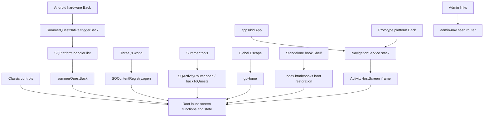

# Summer Quest runtime evidence

Audit date: 2026-10-02. Scope: the merged working tree, including generated `dist/mobile` and `dist/android-web` files. This appendix records source tracing; browser observations and check results are recorded in the main architecture audit. No runtime implementation was changed for this appendix.

## Conclusions supported by the source

1. The reported tablet wording, four places, `LEGACY` badge and right navigation rail identify the **experimental `apps/kid` PlanetScreen shell** precisely. Opening that URL in the audit browser reproduced the signature. They do not identify the root Classic hub.
2. The root runtime contains an actual Three.js world. Its failure handler shows `#worldStatus`; it has no route to PlanetScreen. A WebGL failure in the inspected root cannot explain the reported selector screen.
3. Root/PWA/local-server entry configuration points to `index.html`. The retained prototype remains directly reachable on the source website and is still listed in the service-worker precache. Compiled prototype modules also remain in `dist/android-web/dist/mobile`.
4. The physical tablet's active URL, installed APK bytes, service-worker controller and JavaScript exception have not been supplied or captured. The generated native directory `apps/android/android` is absent from this audit checkout. Therefore the exact **entry-selection cause on the device** remains open; the source that renders the screen is established.
5. The root still has several independent screen-changing paths. In particular `startGame()` bypasses `showOnly()` and does not hide the world. Merely adding a shared registry has not consolidated navigation.

## 1. Search scope and exact tablet signature

The search used `rg --hidden --no-ignore` over repository text, including ignored/generated files, HTML, JS, TS, JSON, CSS, SQL and documents. It excluded `.git`, dependency trees and Gradle caches; binary content was skipped by ripgrep. An initial source search was followed by the broader search without excluding generated build directories. Images cannot contain executable DOM strings; no OCR claim is made.

| Reported text/feature | Exact source | Generated executable copies |
| --- | --- | --- |
| `SUMMER WORLD · 夏日世界` | `apps/kid/src/screens/PlanetScreen.ts:30`; also zone heading in `ZoneScreen.ts:41` | `dist/mobile/apps/kid/src/screens/PlanetScreen.js:13`, `ZoneScreen.js:23`; same paths beneath `dist/android-web/dist/mobile/` |
| `Where do you want to explore?` / `你想去哪裡探險？` | `PlanetScreen.ts:31`, in `renderPlanetScreen()` beginning at line 25 | `PlanetScreen.js:14` in both generated trees |
| `Daily Life` / `生活任務` | `packages/world/src/WorldModel.ts:35`, `WORLD_ZONES` | `dist/mobile/packages/world/src/WorldModel.js` and Android copy |
| `Brain Island` / `頭腦島` | `WorldModel.ts:44` | `WorldModel.js:14` in both generated trees |
| `Science Garden` / `科學花園` | `WorldModel.ts:52` | `WorldModel.js:22` in both generated trees |
| `Play Park` / `遊戲樂園` | `WorldModel.ts:61` | `WorldModel.js` in both generated trees |
| `Tap a place to visit it.` / `點一個地方開始。` | `PlanetScreen.ts:49` | `PlanetScreen.js:32` in both generated trees |
| `Summer Quest` header; World / Quests / Adventure navigation | `apps/kid/src/app/App.ts:37`, lines 45–47 | `dist/mobile/apps/kid/src/app/App.js` and Android copy |
| `LEGACY` | `App.ts:40`: `${platform.kind.toUpperCase()}`; `packages/platform/src/legacy/LegacyPlatformService.ts:18` sets `kind = "legacy"` | Generated App and LegacyPlatformService modules |
| Navigation rail on the **right** | `apps/kid/styles.css:66–73`: landscape media query sets `"screen nav"` grid and one-column nav | Source stylesheet; older deployed/cached copies require device inspection |

The complete heading/hint combination appears only in PlanetScreen and its generated copies, apart from the supplied audit request. Generic terms such as daily life also occur in unrelated content. Uppercase `LEGACY` searches find unrelated identifiers (`LEGACY_KEY`, `LEGACY_TO_GRANULAR`) in quest migration and language rules; those identifiers do not render this badge. The badge is assembled dynamically, which is why searching only literal `LEGACY` is insufficient.

### Exact display chain

```text
/apps/kid/index.html
  -> classic scripts: config, quest-data, quest-config, quest-core, platform
  -> /dist/mobile/apps/kid/src/main.js
     -> bootstrap()
     -> AppSessionStore.load("sq:mobile:session:v1")
     -> URL kid/age/mode and existing sq:kid overrides
     -> write sq:kid; write sq:view = "hub"
     -> createPlatformService()
        SummerQuestNative.native truthy -> android
        otherwise SQPlatform exists    -> legacy
        otherwise                      -> web
     -> new NavigationService({ name: "planet" })
     -> new App(...).mount()
        -> header and World / Quests / Adventure navigation
        -> subscribe() immediately emits current planet route
        -> App.render({ name: "planet" })
        -> renderPlanetScreen()
        -> buildWorldSnapshot() -> WORLD_ZONES
```

Evidence: `apps/kid/index.html:17–22`, `apps/kid/src/main.ts:13–89`, `packages/platform/src/createPlatformService.ts:11–15`, `App.ts:31–62,86–88`, `packages/navigation/src/NavigationService.ts:24–26,59–62`.

`js/platform.js:113` creates `window.SQPlatform` even in a normal browser. Consequently **LEGACY is the expected capability-adapter badge when this prototype is opened in a browser without a native adapter**. It is not evidence that the original product runtime is running, and does not prove an old APK version. It is an intentionally rendered technical badge (`aria-hidden="true"`), visually exposed to children rather than gated behind diagnostics.

The landscape breakpoint is `(orientation:landscape) and (min-width:700px) and (max-height:820px)`. This independently matches the reported right rail. The underlying planet is CSS shapes (`apps/kid/styles.css:27`), not a Three.js canvas.

### Why this path appears instead of the real world

When the prototype entry is executed it **always starts at `planet`**; it does not call root `openWorld()`. Its saved session stores child, age and interaction profile, not a root world route. Root state keys cannot select PlanetScreen because root imports neither the prototype bootstrap nor PlanetScreen.

The inspected source does not establish why the tablet executes that entry despite the reported v0.6.1 root payload. Viable explanations to test include an already open prototype URL, a restored browser/WebView location, a controlling old service worker, a different installed artifact, or an uninspected loader. These are hypotheses, not findings. Do not replace the root payload or clear family state based on them.

## 2. Entry-point inventory

“Reachable” below means a source path/route exists, not that physical device execution was verified.

| Entry | Source / generated | Purpose and current reachability | Recommended disposition |
| --- | --- | --- | --- |
| `/index.html` | Source | Root child runtime; contains Heroes, hub, games, activities, books, Music Room and world | Keep authoritative |
| `manifest.webmanifest:6,26` | Source entry configuration | `start_url` and `id` are `./index.html` | Keep pointing to root |
| `/` through local server | `server/agent-proxy/local-server.mjs:112–116` | Empty path resolves to `index.html`; `kidUrls` at line 383 and printed URL at 399 also select root | Keep |
| `START-SUMMER-QUEST.cmd` | Source launcher | Calls `npm run agent:serve`; it does not redirect to `apps/kid` | Keep |
| `/apps/kid/index.html` | Source | Directly reachable prototype; imports compiled shell and root quest/platform globals | Retain as historical reference pending review; remove from supported product entry/packaging/caching paths |
| `dist/mobile/apps/kid/src/main.js` | Generated JS entry | Prototype bootstrap compiled from `apps/kid/src/main.ts`; not root's module entry | Do not use for production startup |
| `dist/android-web/index.html` | Generated HTML | Current Android web build output; source root copied into it | Regenerate from source; never edit as authority |
| `apps/android/android/app/src/main/assets/public/index.html` | Generated, absent locally | Expected Capacitor payload; quoted by user but not available in this checkout | Verify after sync and against installed APK |
| Native `MainActivity` | `apps/android/native-overlay/app/src/main/java/com/summerquest/app/MainActivity.java` | Source overlay registers plugin then delegates loading to Capacitor; generated activity absent locally | Keep thin container |
| `legacy.html` | No file found in source or local generated outputs | Referenced by Android branch of prototype launcher (`apps/kid/src/main.ts:41`) | Do not recreate; document/remove obsolete consumer after review |
| `#world` | `index.html:801` | A section of the root document entered by `openWorld()`; **not** a URL hash router or another app | Keep behind common navigation API |
| `#hub` | `index.html`, `openHub():2450` | Root Classic view; ordinary tab hashes are read on boot | Keep alternate root surface |
| `index.html#devcube` | `js/main.js:38–54`, `js/games/cube.js` | Explicit development WebGL probe inside root | Keep development-only; never a product world |
| `/admin.html` | Source | Separate Papa operator app, Supabase auth and own admin navigation (`js/admin-nav.js`) | Keep separate operator UI; not a competing child router |
| `/admin-prototype.html` | Source reference | Historical operations mockup with its own example hash navigation | Preserve reference, not product entry |
| `/books/{space,animals,giraffe,science,race-cars,construction,public-vehicles,minecraft}.html` | Eight source pages | Standalone content readers with explicit Shelf links to `../index.html#books` | Retain compatibility; root already reads their shared data without iframe |
| `dist/android-web/books/*.html` | Eight generated pages | Copies of standalone readers | Regenerate; validate deep-link returns |
| `docs/plans/2026-07-27-admin-ops-redesign/admin-prototype.html` | Reference | Protected historical admin design mentioned in `CLAUDE.md` | Preserve |
| `docs/plans/2026-07-27-brain-gym-visual-redesign/design-preview.html` | Reference | Pocket Brain Lab visual/audio preview | Preserve |
| `docs/plans/2026-07-27-brain-gym-visual-redesign/sprite-style-board.html` | Reference | Sprite artwork comparison | Preserve |
| `docs/plans/2026-07-27-brain-gym-visual-redesign/troubleshoot/change-maker-unified-shell-preview.html` | Reference | Change Maker preview, not the child app shell | Preserve |
| `docs/plans/2026-07-27-solar-system/design-preview.html` | Reference | Solar System 3D design draft | Preserve; distinct from world |
| `docs/plans/2026-07-28-music-room/design-preview.html` | Reference | Instrument layout preview | Preserve |
| `docs/plans/2026-07-28-books/45-minecraft-magazine-layout-preview.html` | Reference | Book layout preview | Preserve |

The prototype's own `apps/kid/README.md:3–7` now explicitly says root is authoritative and forbids real content through `ActivityHostScreen`. Executable code and service-worker lists still retain that route. No audit action deletes project files; `CLAUDE.md` requires preserving reference files and obtaining a decision about genuine removals.

## 3. Root startup and state decisions

### Intended native startup

```text
Android launcher
  -> MainActivity.onCreate()
     -> registerPlugin(SummerQuestNativePlugin.class)
     -> BridgeActivity.onCreate()
  -> Capacitor WebView: local HTTPS scheme
     -> assets/public/index.html (generated; absent here)
        -> root classic scripts, in HTML order
        -> inline root definitions and host bindings
        -> async boot: loadProgress() -> restoreAppPlace()
        -> deferred js/main.js publishes game manifest / loader
        -> selectKid() or restored state
           -> world OR hub/content, per branches below
```

Native evidence is **source configuration**, not an observed device trace: overlay `MainActivity.java:9–13`; `apps/android/capacitor.config.json:4–6` sets `webDir=../../dist/android-web` and HTTPS scheme, with no remote `server.url`; native manifest launches `.MainActivity` with `singleTask`.

### Script order

`index.html:1086–1133` loads:

1. Optional `config.js`; shared day/star helpers; vendored Supabase; `SyncStore`; notifications.
2. Day, activity, quest, reward catalogs and quest configuration/progress/core.
3. Event bus, agent memory/context/provider, `SQLearningRuntime`, Summer agent/UI.
4. `SQPlatform`, tool registry, agent tools, activity router, content registry, Brain adapter and orchestrator.
5. Learn data, time/lock/PIN/Papa helpers, drills, Bopomofo, Brain data/core/audio/UI.
6. Eight book data scripts and Minecraft magazine renderer.
7. Deferred ESM `js/main.js`; then the large classic inline root runtime executes.

The inline script binds `SQActivityRouter`, `SQContentRegistry`, `SQAppNavigation`, native Back and `SQHost` before launching the boot IIFE at `index.html:4957`. `js/main.js` publishes `SQGames`, `SQManifest`, `SQLoadGame`, then dispatches `sqmanifestready`. This module is a **game host**, not `apps/kid/src/main.ts` under another filename.

`loadProgress():1493–1500` awaits `SyncStore.init` then normalizes state. Its catch also normalizes local state; it does not launch another shell. The remaining boot sequence is `restoreAppPlace(); setupRealtime(); await refreshStarsFromServer(...); startTimelineWatcher(); refreshTestBanner()`.

`DOMContentLoaded` at `index.html:2063` installs the game-stage WebGL context listeners using the already-defined `SQHost`; it does not pick the initial app view.

### `restoreAppPlace()` branch table (`index.html:4723–4765`)

| Condition, in evaluation order | Result |
| --- | --- |
| Missing/unknown `sq:kid`, or saved view `home` without a recognized tab hash | Render Heroes; `showOnly("home")` |
| Valid child and recognized hash | Set `hubTab` from hash; otherwise use valid saved `sq:hubTab` or `quests` |
| Saved view `act`, stored `sq:actIdx` starts `L` and guide exists | Restore `openLearn()` |
| Saved view `act`, numeric activity exists in `BANK` | Restore `openAct()` |
| Saved view `book` | Restore `openBook(sq:bookId || "space")` |
| Saved view `world` | `openWorld(savedKid)` |
| Saved view `music` | Open Music tab in hub; do not race deferred instrument modules |
| Any remaining valid-child state, including `hub` | `openHub(savedKid)` |

Hash selection only sets `hubTab`; saved `world`, `act` and `book` branches run before the final hub branch. Consequently an explicit `#books` deep link can lose to saved `world`/content state. There is no root `hashchange` handler to reconcile later hash updates.

Fresh Hero selection (`selectKid():1600–1603`) applies cached/current PIN rules, writes `sq:kid`, resets quests, and calls `openWorld()`. PIN success does the same (`1621`). Whole-app lock may intercept (`openWorld():1579`). No release migration resets old `sq:view="hub"` to `world`. Stored hub state legitimately restores Classic, but **cannot produce PlanetScreen**.

Other navigation state: `hubKid`, game `kid`, `level`, `hubTab`, `actIdx`, `bookState`, `learningDirectorLaunch`, `hubReturnSurface`, `contentReturnSurface`, world module/token and per-child camera map. The last two return-surface variables are in-memory, not restored navigation history. `saveAppPlace():1553–1559` persists view, child, tab and activity index. The prototype separately persists `sq:mobile:session:v1` and writes root `sq:view="hub"` on every bootstrap, causing a real cross-entry state interaction.

### Service worker and stale-runtime exposure

- Root registers `./sw.js` on `load` only if `SummerQuestNative.native` is not true (`index.html:4767–4768`). This gate prevents a new registration; it does not unregister an already controlling worker.
- Prototype registers `../../sw.js` outside native mode (`apps/kid/src/main.ts:93–112`).
- `sw.js:1` names cache `summer-quest-v111-miniature-world`, while lines 6–16 still precache the kid prototype, its CSS and compiled screens.
- Installation tolerates individual fetch failures (`sw.js:355–359`). Activation deletes other named caches and claims clients (`367–372`). Same-origin GET handling is network-first, then exact cached request, then root HTML for offline navigation (`375–400`).
- These mechanisms can preserve an explicitly visited prototype URL offline. They do not prove that this occurred on the tablet. Existing worker/controller inspection is needed before proposing any state/cache migration.

## 4. Navigation owners and callers



| Subsystem | Authority today | Evidence and consequence |
| --- | --- | --- |
| Root screen functions | Main product state owner | `showOnly():2424`; `openWorld():1577`; `openHub():2450`; content launch/close functions |
| `summerQuestBack()` | Root Back policy | `index.html:4850–4869`: app lock, overlays, book grid, book/music/act/game, hub, world, then platform exit |
| `SQAppNavigation` | Partial public facade | `index.html:4871` exposes only `back` and `getSurface`; no complete public navigate/open/content/child API |
| `SQActivityRouter` | Adapter/current-activity context, delegated navigation | `js/activity-router.js:7–39`; host binding `index.html:4777–4807`; no own stack, but its tab/back-to-quests handlers directly mutate root state |
| `SQContentRegistry` | Catalog projection and separate dispatch seam | `js/content-registry.js:45–51`, root binding `4812–4847`; root `open` directly calls launchers/tab mutations |
| Three.js world | View with camera/selection state | Calls `registry.open(selected.id,{origin:"world"})` at `js/world/world-explorer.js:296`; no router/back stack |
| Root keyboard | Additional Back policy | Global Escape calls `goHome()` at `index.html:2301`, bypassing overlay/book/music-aware `summerQuestBack()` |
| Root button callbacks | Several direct mutations | `hubBack:3324`, quest/today callbacks at `3001,3116–3117`, lock redirections at `2238–2249`; `worldHeroes:4873` |
| Native bridge | Event delivery, not content router | Java `onBackPressed():18–33` evaluates `SummerQuestNative.triggerBack()`; `js/platform.js:22–23,32` dispatches registered callbacks in reverse order |
| Parent iframe native adapter | Retained compatibility path | `js/platform.js:90–108` proxies same-origin parent native capabilities and lifecycle; root top-level does not need it |
| Prototype `NavigationService` | Competing child-app route stack | `packages/navigation/src/NavigationService.ts`; push/replace/reset/back; `App.ts:51–61` owns buttons and Back |
| Prototype activity adapters | Whole-app iframe launch | `LegacyHubSectionAdapter.ts`, `LegacyBrainGymAdapter.ts` return `embedded`; `ActivityHostScreen.ts:29` creates iframe |
| Prototype browser platform | Browser Back listener | `WebPlatformService.ts:8` listens `popstate`; its route stack itself does not call browser `pushState` |
| Standalone book navigation | Document navigation | `books/space.html:206`; other Shelf links at line 221, Minecraft 165; all target root `#books` |
| Admin router | Separate operator application | `js/admin-nav.js:25,46,100,147`: hash route/replaceState; preserve outside child navigation scope |

No child-runtime `postMessage` bridge or browser `history.pushState` router was found in inspected source. Existing parent calls are direct same-origin native capability accesses. In-game camera/menu controls are local content state, not additional app shells.

### Concrete navigation defects to recover first

- **World → direct game leaves two sections visible.** `startGame():1735` remembers origin but lines 1753–1755 hide only `home`, `hub`, `act`, then reveal `game`. It never calls `showOnly("game")`, so `world` remains visible, `world-mode` remains set and world rendering is not paused. Featured Solar/Truck/Paint routes use this function. The audit browser reproduced simultaneous `world` and `game` visibility by opening `game:calc` through the registry; a check that only asks whether `#game` is visible misses the defect.
- **Public return policy is incomplete.** There are two dispatch facades plus direct UI mutation, a DOM-driven Back routine and separate `goHome()` behavior. Shared implementation exists but callers do not consistently use it.
- **Deep-link precedence is inconsistent with standalone Shelf intent.** `#books` does not override saved world/content state as described above. Root in-app books do not use those standalone pages, so do not claim every book return is broken.
- **Old iframe path remains executable on the source website.** Prototype activity navigation can still embed root; README deprecation alone does not disable it. Its native `./legacy.html` destination is absent in the current bundle. This is distinct from proof that the current root recursively embeds itself; no such root path was found.
- **Origin can be recorded before launch succeeds.** `rememberContentReturn()` precedes locks/availability checks in `startGame`, `openAct` and `openBook`. Failed opens can leave a pending return origin. Follow-up navigation tests should cover locked/unavailable launches without making claims about observed state corruption.

The target should retain root as the sole child navigation/state owner. Both registries/adapters and all UI surfaces should delegate to its public API. Android should deliver Back, the world should keep camera state, and admin should remain a separate authenticated operator app.

## 5. Real 3D world audit

### Files and module graph

```text
index.html:1587 dynamic import
  -> js/world/world-explorer.js
     -> js/vendor/three.module.min.js
        -> js/vendor/three.core.min.js
     -> js/vendor/OrbitControls.js
        -> ./three.module.min.js
css/world-explorer.css supplies root world layout
```

Generated copies exist beneath `dist/android-web/`. `js/vendor/README.md` records Three.js **0.185.1**, original unpkg URLs and the local OrbitControls import patch. The vendor core declares revision `185`. The packaged code requests `webgl2` and explicitly rejects WebGL1; compatibility must therefore be established on the actual tablet WebView. No external CDN request is needed for the world module graph, and no bare `three` import remains in OrbitControls (`line 12`). These are source properties, not physical compatibility proof.

Other 3D content is separate: `js/games/solar.js` and `js/games/cube.js` use the game-platform host; the Solar design preview is a reference. `packages/world/src/WorldModel.ts` is the flat shell's zone model and does **not** initialize the miniature world.

### Initialization and interaction

| Concern | Current behavior / evidence |
| --- | --- |
| Start | `openWorld()` validates child and lock, sets world view, updates HUD, imports module, checks token/view/child, then calls `start()` (`index.html:1577–1595`) |
| Prerequisites | `start():333–337` requires mount and registry; same child resumes existing instance; changing child destroys/recreates |
| WebGL | `createWorld():191–207` constructs perspective camera and `WebGLRenderer`, caps DPR at 1.55, enables soft shadows and appends canvas |
| Camera | OrbitControls at `209–214`: damping, no panning, zoom distance 8.2–15.2, polar angle 0.66–1.22 |
| Touch | Vendored OrbitControls defaults one finger rotate and two finger dolly/pan (`371`); pan is disabled by world; pointer capture/cancel and `touchAction=none` are implemented in controls. CSS also disables native touch gestures on canvas |
| Raycast | `world-explorer.js:272–290`: pointer-up with travel <=11px and duration <=700ms raycasts registered meshes and selects a landmark |
| Activation | Selection requires GO; `296` calls registry with `origin:"world"`. Promise rejection is swallowed; a resolved `{ok:false}` has no visible feedback |
| Destinations | Eight hard-coded section IDs (`236–245`) plus four featured IDs Truck, Solar, Space book, Paint (`246–250`). Each resolves live registry entry and skips absent/unavailable items |
| Coverage | World is a hand-maintained map of categories and four featured items, not every item in registry. Category buildings lead to the Classic hub |
| Camera persistence | `savedViews` is in-memory Map (`5,299–300,316–318`); resume preserves a child's live instance; full reload loses camera state |
| Pause | `showOnly()` pauses world when leaving; visibility handler pauses hidden document; return resumes (`index.html:2430`, world `316–327`) |
| Context loss | Canvas `webglcontextlost` pauses and calls status `paused`; restored calls `ready` and resumes (`326–327`) |
| Disposal | Controls/renderer/listeners/observer disposed, but world geometry/material resources are not explicitly traversed and disposed (`322–330`); repeated child switching warrants memory measurement |

No WebGL initialization is attempted by the flat PlanetScreen. No module in this world graph imports the prototype.

### Failures, fallback and limits of the evidence

`index.html:1596–1597` catches dynamic import or awaited initialization errors, logs **“Summer Quest 3D world failed”**, and reveals `#worldStatus`. The Classic button remains available; `worldClassic:4874` opens root hub only when tapped. **There is no automatic fallback to PlanetScreen or Classic.**

Errors thrown later from animation frames are outside that `try` and have no generic world error boundary. Context loss has a dedicated callback; other render exceptions are not represented by the status path. The world mount can contain a canvas before a successful rendered frame, so canvas existence alone is not proof of healthy rendering.

Further source-level risks, not verified device failures:

- Landmarks are sampled once when a child's world instance is created. `sqmanifestready` only redraws hub and game switcher (`index.html:4950–4954`), and same-child world resume does not rebuild destinations. Delayed manifest publication or changed locks could leave the visible landmark set stale while registry content changes.
- Tap selection tracks one `down` record and does not independently distinguish multi-pointer pinch or pointer cancellation; controls handle their own pointer state. Verify pinch does not inadvertently select a place.
- HUD text such as Heroes, Classic menu, interaction hint and GO is not consistently bilingual (`index.html:805–818`); non-reading interaction depends on recognizing relatively generic buildings and a second GO action.
- Native pause/audio focus events exist in `js/platform.js`; world itself subscribes only to document visibility and WebGL context events. Confirm real lifecycle delivery on the device.

**Is the world genuinely initializing on Android?** Unknown from this checkout. Native generated files are absent, and a follow-up ADB check detects one device whose USB-debugging connection is unauthorized; no tablet WebGL context or console trace is available. The precise failure cause cannot honestly be captured without that evidence. Local browser findings in the main report are expressly separate from Android verification.

## 6. Existing checks and what they miss

The new read-only audit probe is `scripts/audit-architecture-runtime.py`; its machine-readable observations are in `docs/audits/runtime-probe.json`. It runs a temporary localhost server with remote services and service workers blocked, replacing config responses for local-only operation. Desktop software WebGL is explicitly not Android evidence. The probe reproduced root and generated-root Hero → world initialization, the prototype signature on its own URL, and the two-visible-sections game defect. Root and generated-root registry counts were both 51 after waiting for the 24-item game manifest. This readiness wait matters because the fallback catalog before deferred manifest publication is smaller. Additional isolated contexts forced WebGL creation to fail: both root variants displayed the world error and stayed on the world surface without opening PlanetScreen. That check passed; the normal game-launch invariant remains failing.

- `scripts/world-explorer.test.mjs` checks text patterns, IDs and files. It never creates a browser/WebGL context or executes `selectKid()`.
- `scripts/check-world-explorer-ui.py` is better: runs `dist/android-web`, chooses a hero, expects world canvas, checks book/section/Classic round trips. It uses desktop software WebGL flags. It does not click projected landmark hit targets, exercise featured game launch, prove camera movement/pinch, inspect every visible root section, or test the post-sync native assets.
- `scripts/check-unified-runtime-ui.py` expects hero → **hub**, while current source chooses **world**. It will wait for the obsolete default before its content checks. A prior passing run does not validate v0.6.1 behavior.
- None of these scripts establishes what URL/controller/module is running on the physical tablet. The source report cannot convert static pass results into physical success.

Required follow-up checks after the reviewed integration change:

1. Cold launch with empty state and existing valid child state; verify exactly one visible app section and expected default, including explicit deep links.
2. Hero → world → direct featured game → shared Back → same world/camera; repeat with failed/locked launches.
3. World → Classic games → game; Books → two different books; Music → each instrument; Learning → activity; repeat using UI Back, native/shared Back and Escape where supported.
4. Assert no iframe contains root app, no `.mobile-app-shell` in production, one global header/nav, and no `legacy.html` product route. Count actual visible surface IDs, not only expected destination existence.
5. Force import failure and WebGL context creation failure; require visible error and **no PlanetScreen fallback**. Force context loss/restoration and verify frame recovery.
6. Run against `apps/android/android/app/src/main/assets/public` after actual sync, then installed APK; retain payload/hash/entry diagnostics along with DOM/runtime observations.

## 7. Evidence needed from the physical tablet

Collect before changing persistent state:

- Foreground Android package/activity and installed version/build; exact loaded document URL, origin, `document.baseURI`, top/self relation and all frame URLs.
- Current entry HTML/module scripts, DOM `.mobile-app-shell` / `#world` / `#worldStatus`, and native adapter capability flags.
- Controller script URL and registered service-worker scopes/cache names if available; compare entry bytes with the installed payload, not just build metadata.
- Safe navigation state keys (`sq:view`, selected child identifier and `sq:hubTab`), runtime surface, registry count, manifest readiness, world snapshot and WebGL2 creation result. Avoid exporting unrelated family/auth data.
- Console/network errors during cold startup and Hero selection, including exact failed local module URL and stack trace.

These observations will distinguish stale/alternate entry execution from a real world initialization failure. The current report establishes the rendering path without inventing the missing device cause.
