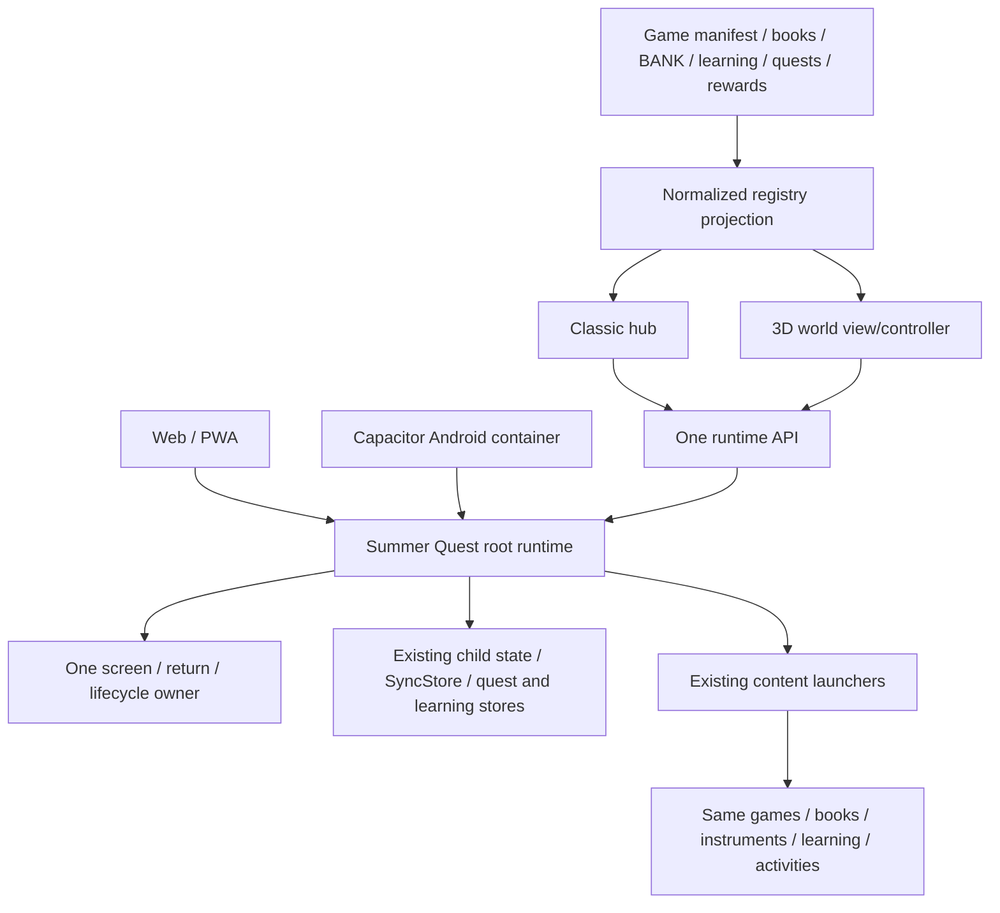

# Summer Quest architecture recovery plan

Date: 2026-10-02. **Strategy C approved by the user; implementation and software acceptance results recorded below. Physical tablet acceptance deferred by the user: the tablet is disconnected.**

Basis: [architecture audit](../audits/SUMMER-QUEST-ARCHITECTURE-RECOVERY-AUDIT.md) and its evidence appendices. The user's implementation instruction explicitly passed the audit review stop. Existing plans remain historical references; Strategy C supersedes their conflicting shell-in-iframe direction.

## Approved decision

Implement **C: selective merge**, keeping the existing root runtime's product, navigation, and state authority. Adopt the useful Android bridge, typed learning services, registry projection, and world screen. Remove executable prototype routing from shipped assets. Do not restore the entire original revision or promote `apps/kid` into the product.

The diagnosed selector is the `apps/kid` Planet route. The installed tablet's actual entry chain is still an evidence gap. Capture it before clearing cache, uninstalling, overwriting the APK, or migrating saved state.

## Candidate strategies

### A. Original root authority, minimal additions

Keep root launchers/state and all working content; expose a public API and attach registry/world. This is viable and minimizes migration. It also leaves some useful newer platform, learning, and diagnostics work needing explicit reconciliation. “Original” means continuity of root ownership, not a Git reset that discards later content.

### B. New root controller with adapted old content

Technically possible only as a same-document extraction: move root state/transitions into a new controller and adapt existing game/book/music functions directly. Do not use `apps/kid` iframe adapters. This is **not ready for immediate implementation**: most launchers close over inline globals, and the audit does not demonstrate a safe drop-in controller. It requires compatibility tests and incremental extraction before changing ownership. A new state store/router now would multiply migration risk without improving content coverage.

### C. Selective merge (recommended)

Keep root as authority and preserve its catalog/SyncStore contracts. Reconcile the existing platform bridge, typed learning, quests, content projection, and 3D screen. Retire shell-specific routing/session/iframe behavior from product builds. Extract code only when an agreed slice needs it; do not make a large file split a prerequisite.

| Criterion | A: root + minimal additions | B: new controller | C: selective merge |
| --- | --- | --- | --- |
| Existing game breakage | Low | High during extraction | Low; fix shared transitions |
| Duplicate navigation | Low after entry retirement | High while owners overlap | Low with explicit root authority |
| Rewrite amount | Small | Large | Small/medium, bounded slices |
| Content coverage | Preserves catalogs; adapter gaps remain | Every launcher needs adaptation | Preserves catalogs, closes measured gaps |
| Young children | Existing access plus world | No automatic benefit | World discovery after stable navigation |
| Android offline | Packaging/bridge still need work | New deployment/runtime risks | Reuse local bridge and deterministic packaging |
| Performance | Existing behavior | Extraction benefit unproven | Pause world and dispose content correctly |
| Maintainability | Inline coordination remains | Better only after costly migration | One API without mandatory wholesale rewrite |
| Future 3D support | Good through root API | Possible, unnecessary prerequisite | Good; world remains a view/controller |
| Testability | Improve current launch checks | Must recreate broad contracts first | Tests target existing behavior and gaps |
| Migration safety | High with key preservation | Lowest | High with staged key-compatible changes |
| User state | Existing keys/store | Requires explicit ownership migration | Existing keys/store and ledger retained |

## Target architecture and contract



Extend the current root API instead of introducing another router. Names can remain compatible with `SQAppNavigation`:

```js
SummerQuest.navigate(destination)
SummerQuest.back()
SummerQuest.openGame(id)
SummerQuest.openBook(id)
SummerQuest.openActivity(id)
SummerQuest.openMusic(id)
SummerQuest.openLearning(id)
SummerQuest.openQuest(id)
SummerQuest.getContentRegistry()
SummerQuest.getCurrentChild()
```

Contract requirements:

- Runtime validates destination, child, category access, Brain Gym/Paint exceptions, and content availability once. Classic/world/agent actions share it.
- Successful launch means the requested content has opened; return a failure reason for lock, invalid ID, missing module, or failed initialization. Await asynchronous launch work.
- One screen is active at a time. Transitions pause world rendering, stop outgoing content/timers/audio as appropriate, update router context, and persist place consistently.
- Runtime owns return destinations and native Back. The world owns camera/selection state only. Preserve camera while content is open; it never creates a parallel application back stack.
- Learning's internal lesson progression and an instrument's internal controls remain content-local state; they are not additional global routers.
- Registry is derived from real catalogs and readiness. Keep existing IDs, aliases, and storage identity. Do not create a parallel content database or hard-code showcase coverage.
- Development errors remain visible. A WebGL failure must display its reason with an explicit Classic action; tests must fail it as world startup failure.

## Files to keep, adapt, and retire

| Disposition | Files/modules | Reason |
| --- | --- | --- |
| Keep | `index.html`, `js/sync.js`, `js/day.js`, real game modules, `js/games/index.js`, `js/brain/`, `js/books/`, `books/`, music services and assets | Authoritative accumulated content and state |
| Keep | `js/learning-runtime.js`, `packages/learning/`, agent bridges/providers/server, quest/reward data/core/progress | Useful later product functionality; verify dependencies before pruning |
| Keep | `admin.html`, admin JS/CSS, existing plans/design references | Separate parent application and project records |
| Adapt | `index.html` launchers, `SQAppNavigation`, `js/activity-router.js`, agent navigation hooks | One public transition/launch contract and shared Back |
| Adapt | `js/content-registry.js` and root binding | Complete projection; preserve catalog IDs and lock semantics |
| Adapt | `js/world/world-explorer.js`, `css/world-explorer.css` | Registry-driven destinations, lifecycle/error/camera contracts; polish last |
| Adapt | `js/platform.js`, native-overlay Java/manifest | Top-level native bridge and Back, remove obsolete parent forwarding |
| Adapt | `package.json`, lockfiles, `scripts/build-mobile.mjs`, `scripts/build-android-web.mjs`, `tsconfig.mobile.json` | Reproducible compiler ownership and minimal runtime output |
| Adapt | `apps/android/scripts/*.mjs`, `scripts/lib` helper under that directory, `capacitor.config.json` | Safe Windows processes, cwd, SDK/JDK gates, executable payload verification |
| Adapt | `sw.js`, `manifest.webmanifest`, `.github/workflows/pages.yml`, Android/root README and acceptance scripts | One product entry and explicit distribution rules |
| Retire from execution | `apps/kid/index.html`, `apps/kid/src/app/App.ts`, shell screens/bootstrap/runtime controller | Second application/session/navigation owner |
| Retire after import audit | `packages/navigation/`, shell `AppSessionStore`, `packages/world/` Planet model, `packages/activities/src/legacy/` adapters | Prototype router/world/iframe plumbing; keep anything proven shared until detached |
| Exclude from child shipping | `admin-prototype.html`, plan prototypes, `#devcube` dev entry | Preserve historical references without production child entry exposure |

Retirement sequencing: first stop shipping/caching/linking executable shell entry and modules, then detach unused imports/tests, then remove deprecated executable files in reviewed commits. The requested cleanup authorizes retirement; it does not require deleting historical design documents or useful content. No removal is performed by this audit.

Generated directories that can be regenerated **after preserving device/build evidence and confirming tool inputs**:

- `dist/mobile`, `dist/agent-proxy`, `dist/android-web`: compiler/package output; never primary source. Review ignore/tracking policy and CI build together.
- `apps/android/android`: generated Capacitor/native workstation project under current policy. Keep native edits in `native-overlay`; preserve local.properties, signing setup, and any unported native changes before regeneration.
- Android `assets/public`: only regenerated by sync; do not hand-patch.
- Android `.reports`, Gradle caches and build outputs: local diagnostics/build products, not product source. Keep the specific audit captures until diagnosis is resolved.

## Compatibility and state plan

- Preserve `sq:kid`, current progress, queue, best scores, vocab, Brain Gym, quest/learning records, and star ledger contracts. No localStorage.clear(), database reset, or star-counter reconstruction.
- Preserve valid saved Classic sessions deliberately. Fresh selection may enter world. Document one migration rule for saved views instead of silently forcing every child into a new surface.
- Preserve standalone `../index.html#books` links and known game/book IDs. If a deprecated entry needs a transition link, route once to the root document without embedding it or registering a competing router.
- Keep `activity:<index>` aliases stable. Introduce durable IDs only with an explicit old-index mapping; never reorder BANK as incidental cleanup.
- Keep platform storage origins in mind: browser/PWA and Capacitor origin data are separate. Back up/test real old profiles before changing app ID, scheme, host, database, or storage driver.
- Compare old stored child/view snapshots and offline pending writes before/after every state-affecting slice. Store no private keys or family data in audit fixtures.

## Implementation checklist and acceptance gates

### Phase 0 — preserve evidence and confirm installed entry

Dependencies: none. Required before claims about the physical tablet cause.

- [x] Record overlaid source, generated payload identity, exact selector path, and browser behavior.
- [x] Add a re-runnable probe that exposes the world/game coexistence failure.
- [x] Check device availability: implementation pass saw one unauthorized device; the follow-up acceptance attempt on 2026-10-02 saw no device. The user confirmed the tablet was removed and deferred the physical pass.
- [ ] Capture installed package ID/version, launch activity, WebView `location.href`, loaded root/module URLs, service-worker controller/scope/cache identity, bridge-native flag, current surface and saved view keys.
- [ ] Compare actual native `assets/public` and installed APK payload against source/dist before rebuilding.
- [ ] Record the exact device entry-selection cause; do not infer it from the badge or bundle metadata.
- [x] Review Strategy C and the file/state scope below (explicit user authorization, 2026-10-02).

DONE WHEN: device diagnosis separates entry/cache/native bridge problems from world initialization, and the architecture decision is reviewed.

### Phase A — one authoritative application entry

Files: shell entry/bootstrap, root/Android manifests, service worker, build/deployment configuration and documentation.

- [x] Make root the only shipped child application entry; stop caching/distributing the Planet/ActivityHost shell.
- [x] Preserve the separate parent admin entry and useful content/modules.
- [x] Add an entry check against source, served output, and native output; fail any runtime import that bootstraps the child shell.
- [x] Prove existing child/state/PIN selection and saved Classic/world views work without resetting data (isolated synthetic saves).
- [x] Add hidden developer diagnostics: release, entry URL, runtime, current screen/child, return stack/context, world initialized, WebGL, registry count, native bridge. No default debug label in child UI.

DONE WHEN: web/PWA/Android all enter root; deprecated executable shell is unreachable from the shipped product; no app-root iframe.

### Phase B — consolidate navigation and lifecycle

Files: root launchers/Back/Escape, activity router, agent actions, platform bridge, content openers.

- [x] Expose the shared API over existing launchers; migrate Classic and world callers to it.
- [x] Route `startGame` through shared surface transition/pause behavior, retaining gates and initialization order.
- [x] Unify Back button, native Back, Escape, overlays, book zoom/grid, game exit, activity exit, instrument exit, and standalone return semantics.
- [x] Preserve world camera during content visits and clear stale return state when choosing another child.
- [x] Remove obsolete iframe/parent navigation adapters after remaining callers are gone (historical shell source retained outside execution).
- [x] Make the audit's source and generated game-launch invariant pass.

DONE WHEN: one visible application screen, one global navigation shell, consistent return destination, no accumulating headers or active hidden renderer/audio.

### Phase C — complete the normalized catalog

Files: registry/root binding, existing learning/quest/reward catalog readers and availability functions; no copied content data.

- [x] Assert source catalog coverage for all 21 games, 3 instruments, 8 books and 11 activities.
- [x] Add learning/knowledge/quest discovery through existing catalog/store projections; document intentional exclusions for internal practice steps or dynamically generated assignments.
- [x] Preserve IDs/aliases and await manifest readiness; reflect new content without editing a second catalog.
- [x] Use authoritative availability checks, including Brain Gym/Paint exceptions and missing-module failures.
- [x] Return truthful launch completion/failure; test invalid IDs and blocked/failed opens.

DONE WHEN: every playable item is discoverable or explicitly excluded with a reason; Classic/world expose the same permissions and launch targets.

### Phase D — deterministic web/Android tooling

Files: package/locks, mobile/web builders, Android helper/bootstrap/sync/build/doctor, CI, package verification tests.

- [x] Declare/pin root-owned TypeScript and tested Node/tool versions; include appropriate root/Android locks.
- [x] Invoke installed Node CLI entry points directly where possible. Use explicitly quoted, controlled `cmd.exe /d /s /c` only for unavoidable batch commands; reject unsafe shell arguments.
- [x] Fix helper call sites to pass `{cwd: ...}`; cover paths with spaces and process error propagation.
- [x] Check prerequisites before removing build output. Resolve absolute deletion targets within intended generated directories.
- [x] Keep JSON Capacitor configuration; check pinned Gradle/AGP/Capacitor and accepted JDK range, and test doctor failures on unsupported majors.
- [x] Verify SDK discovery/local.properties setup from a clean native project.
- [x] Build a minimal root payload with local world/Three.js/core/OrbitControls/registry/learning assets; exclude shell boot modules and prototypes.
- [x] Compare source and payload file coverage in both directions with explicit exclusions; require every referenced book image to exist. A matching self-reported hash does not detect omitted assets.
- [x] Sync and test **native** `apps/android/android/app/src/main/assets/public`, traversing actual HTML/module imports and executing startup there (desktop browser serving the synchronized files).
- [x] Make CI build required generated modules from a clean install; do not publish the whole mixed repository as the child bundle.

DONE WHEN: fresh checkout -> install -> build -> sync -> Gradle is repeatable on Windows, correct native executable startup is demonstrated, and two clean builds have equal intended payloads.

### Phase E — content and state regression

Files: existing browser scripts, registry/Android tests, content inventory/asset checks.

- [x] Automate Hero -> child -> world/hub -> Games -> real game -> Back -> Books -> Space -> Back -> Books -> another book -> Back -> Music -> instrument -> Back -> Learning -> real activity -> Back.
- [x] Repeat through Classic clicks and world launches; test both button and native shared Back. Assert exactly one global shell/header and no nested root/legacy iframe after each step.
- [x] Exercise every catalog item from both entry surfaces where applicable; account explicitly for locked/age-limited items.
- [x] Verify all integrated book-data assets as well as standalone book assets; check all three instruments and game module loading.
- [x] Test existing saves, pending offline writes, lock exceptions, PINs, fresh start, restored views, missing config, and offline warm/cold startup (synthetic saves, worker-controlled reload and new document; physical cold process pending).
- [ ] Run the same suite on source, generated web, synchronized native payload and the physical tablet; label software WebGL results separately.

DONE WHEN: full content click-through has explicit outcomes with no unexplained failures; all navigation/state/asset regression gates pass.

### Phase F — refine world only after A–E

Files: world module/CSS, registry consumers, browser/device interaction checks.

- [x] Map normalized content to places and discovery affordances; retain real content/IDs and accessible Classic access (places open the existing complete section catalogs).
- [x] Assert camera rotation changes numerically and pinch stays bounded; raycast real visible landmarks rather than only calling APIs in tests.
- [ ] Verify camera/selection persistence, resize, context loss/recovery, background/resume, error visibility, and Android Back on hardware.
- [x] Force local module-import and WebGL initialization failures; assert a visible diagnostic and no PlanetScreen fallback.
- [x] Provide English and Traditional Chinese controls and non-reading discovery affordances, consistent with the existing child-facing language contract.
- [ ] Evaluate child-friendly physical places, performance and touch targets before visual polish. Characters/decorations/day-night remain later product work.

DONE WHEN: a child can explore, launch real content, and return to the same world on the tablet without reading-dependent navigation or a second application shell.

## Audit review stop — passed

The audit-only delivery remains recorded at `29b1f0e`. The user authorized implementation beyond its review stop. The implementation branch preserves the overlaid application and fixes the recorded failures. Physical entry diagnosis still requires an authorized tablet; desktop and packaged-payload checks do not establish what the existing installed app runs.

## Implementation record

### Runtime and catalog

- Root `index.html` owns navigation, child state and content lifecycle. `SummerQuest` and the compatible `SQAppNavigation` alias expose the shared launch/Back/diagnostic API; Classic, world and agent actions use it.
- `apps/kid/index.html` redirects once to root without writing family state. Its historical TypeScript remains in source, excluded from compilation, precaching and shipped payloads. The parent interface remains separate.
- Shared transitions pause the world, cancel pending game/Brain/instrument opens, stop outgoing timers/audio, and pause directed learning. Buttons, Escape and native Back use the same policy. Explicit book hashes override saved views; valid saved Classic sessions remain Classic.
- The registry projects 90 default entries: 8 sections, 21 games, 3 instruments, 8 books, 11 activities, 3 guides, 18 lessons, 2 learning modes, 12 quests and 4 rewards. Configured quests/rewards continue to come from their existing catalogs. Activity indexes and guide completion IDs stay unchanged.
- Brain Gym, directed learning and Paint keep their game-lock exceptions. The Games section remains reachable so its permitted activities can be found; individual game launches enforce access. Book/music category exemptions and whole-app pause remain intact. Lessons retain age limits.
- Internal skill IDs, generated questions, Math/Language teaching steps, lesson Explore/Check phases and help cues are represented by their owning session/lesson. They are not separate global launch destinations. Opening a reward focuses its existing shop card; it does not redeem it.
- The world retains per-child camera/selection in additive `sq:world-view:<child>` keys, refreshes availability on return, disposes GPU/listener resources, and guards hidden/native/context-loss resume. Failures stay visible with Classic access. No visual redesign was introduced.
- Content sweeps found and fixed Drum Pads teardown closure errors, late Solar initialization after exit, a request for an absent optional Pluto texture (existing flat appearance retained), and lesson launches invalidated by passive rendering.

### Build and distribution

- Root owns pinned TypeScript 5.9.3 and Three.js 0.185.1; root and Android dependency locks are committed. Shared compiler entry points run through Node. Obsolete Node flags and Windows `.cmd` compiler fallbacks are removed.
- Windows batch invocation is explicitly quoted and validates arguments. Gradle receives its real project working directory. Doctor validates JDK 21–24, SDK 36, Gradle 8.14.3 and AGP 8.13.0; SDK property repair retains unrelated settings.
- Web builds compile dependencies before replacing output, include all source book assets and admin, and exclude shell bootstrap/prototypes. Verification compares source/output in both directions, validates imports and book image references, recomputes hashes, and checks synchronized native `assets/public` when present.
- CI installs from the root lock, builds generated modules and publishes `dist/android-web`. Generated modules/native project, dependency directories, `.reports`, `.tmp`, provider credentials and family telemetry stay untracked. Original audit payload evidence is retained locally under `.tmp/architecture-recovery/preserved-android-web`; its identity remains in the audit.
- The generated debug APK is build evidence. The native template currently has versionName `1.0` / versionCode `1`; the existing tablet version is unknown. No install, uninstall, app-data clear, app-ID change or storage-origin change was performed.

### Validation and remaining acceptance

Command results, artifact identities, clean-checkout comparison and evidence limits are recorded in the [recovery results appendix](../audits/SUMMER-QUEST-ARCHITECTURE-RECOVERY-RESULTS.md). The checklist's device-specific boxes stay open until hardware evidence is available. Visual polish remains deferred.

### Physical acceptance follow-up — deferred, 2026-10-02

Branch `fix/android-device-acceptance` starts at `eb2065b`. Only acceptance documentation changed; no device inspection beyond ADB availability, installation, settings change or physical test occurred. Existing installation identity and the cause of the tablet mismatch remain unknown.

Resume Phase 0 before installing: capture the original APK, package/version/signature/activity, actual WebView entry/modules/bridge/cache/surface and available saved-state evidence in ignored local storage. Establish a compatible package, signer, versionCode and unchanged storage origin before updating in place. Preserve family state and queued ledger operations; no uninstall, data clear or cache deletion. Continue physical content/navigation/touch/audio/lifecycle/offline acceptance afterward, retaining the distinction between device observations and desktop regression results.

### Desktop acceptance follow-up — 2026-10-02

The user deferred Android work and authorized focused desktop fixes, browser validation, commits and a pushed follow-up branch. `fix/desktop-browser-acceptance` starts at `e00a2eb`, preserving both recovery implementation and Android deferral. Root authority, catalogs/IDs, SyncStore keys, learning access and star rules remain the contract; no new shell/router/catalog or redesign is introduced.

- [x] Build shared modules and serve root HTTP at `http://127.0.0.1:9000/index.html`; use visible installed Edge with isolated synthetic profiles and local-only configuration.
- [x] Observe hardware-rendered 3D, mouse rotation/wheel limits/landmark GO, Classic switching, content return and camera restoration.
- [x] Account for every catalog entry through visible controls: 81 launches, 5 schedule-unavailable quests, 4 offline reward requests; verify six youngest-profile lesson restrictions. Separate launch coverage from representative gameplay.
- [x] Fix double book Escape, keyboard book/PIN/keybed interaction, missing knowledge feedback, failed-game error visibility and browser Back/Forward through shared navigation. Preserve directed learning when traversing history; keep native restoration unchanged.
- [x] Fix missing offline book images and protect runtime cache writes; strengthen asset/worker/browser checks without clearing family data.
- [x] Finish final required gate, source/web runtime checks, synthetic persistence and controlled offline reload/new-document checks; record actual outcomes in the results appendix. Source normal/offline, all 9 web scenarios, 10 focused history checks and 16 headed persistence/offline checks passed.
- [x] Explicitly stage source/docs, commit conventionally and push the desktop follow-up branch; leave the local server available. Implementation `7de27df` is pushed, with the evidence update in the following documentation commit; the isolated browser and root HTTP server remain available.

See [desktop evidence and limitations](../audits/SUMMER-QUEST-ARCHITECTURE-RECOVERY-RESULTS.md#desktop-browser-acceptance--2026-10-02). Remote authentication/sync/redemption, human audio listening and real desktop background suspension are not established. The physical Phase 0/E/F boxes above remain open.
